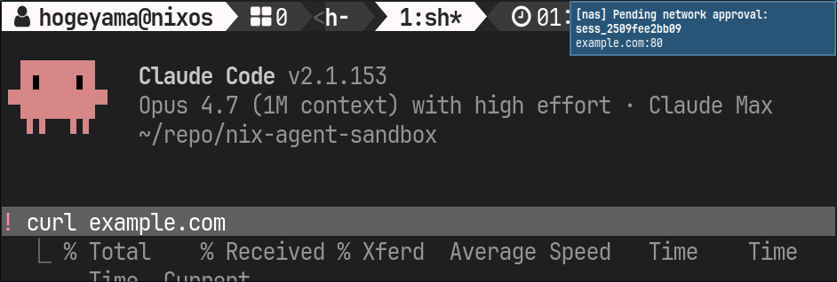
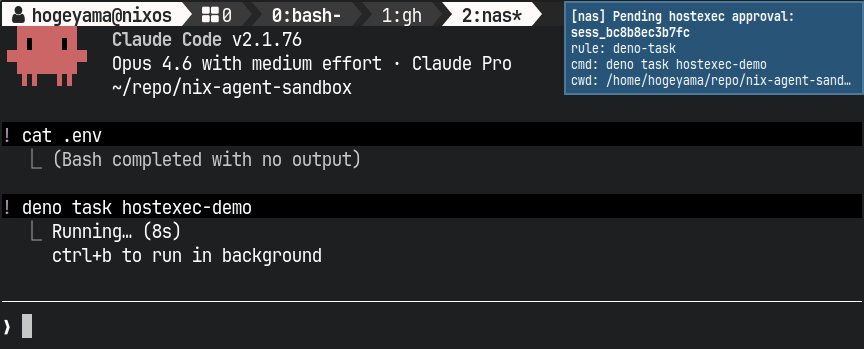
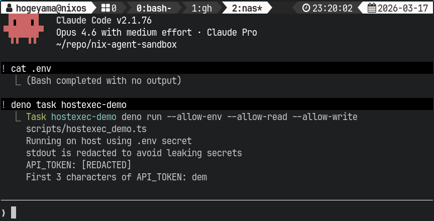
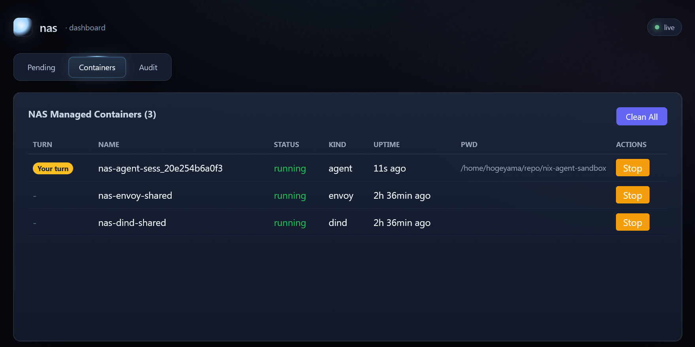

# nas — Nix Agent Sandbox

Docker を使って、AI エージェント用の隔離された作業環境を起動する CLI ツールです。デフォルトでホストのファイルシステムやネットワークを隔離し、必要に応じてアクセスを許可できます。Claude Code / GitHub Copilot CLI / OpenAI Codex CLI に対応しています。
[agent-workspace](https://github.com/hiragram/agent-workspace) にインスパイアされました。

> [!NOTE]
> **名前について**: 当初は「Nix 統合」と「Docker in Docker」を主目的として *nix-agent-sandbox* と命名しました。
> その後、ネットワーク制御・コマンド移譲・Worktree 管理など様々な機能が追加された結果、
> Nix 統合は数ある機能のひとつに過ぎなくなっています。

## 前提条件

- Linux
- **Docker** (20.10+)
- **Nix** (multi-user installation)
  - `nix profile install` で導入する場合や、非 Nix ユーザー向け配布バイナリを作る場合に必要
- **エージェントバイナリ** — スタンドアロンバイナリとしてインストール済みであること（npm 版は不可。詳細は[制約・注意事項](#エージェントバイナリ)を参照）

<details>
<summary>エージェントのインストール</summary>

エージェントは **npm ではなく、公式のスタンドアロンバイナリ** をインストールしてください。

**Claude Code:**

```sh
# 公式インストーラー
curl -fsSL https://claude.ai/install.sh | bash
```

**GitHub Copilot CLI:**

公式のインストール手順に従ってスタンドアロンバイナリを導入してください。

**OpenAI Codex CLI:**

[Releases · openai/codex](https://github.com/openai/codex/releases) からインストールしてください。

</details>

## インストール

### GitHub Releases からインストール

GitHub Releases からビルド済みバイナリをダウンロードできます（x86_64-linux / aarch64-linux）。

```sh
# x86_64-linux
gh release download --repo Hogeyama/nix-agent-sandbox --pattern 'nas-*_x86_64-linux.tar.gz' -O - | tar xz -C ~/.local/bin

# aarch64-linux
gh release download --repo Hogeyama/nix-agent-sandbox --pattern 'nas-*_aarch64-linux.tar.gz' -O - | tar xz -C ~/.local/bin
```

> [!NOTE]
> aarch64-linux 版は動作未確認です。

### ローカルでビルドしてインストール

```sh
nix profile install github:Hogeyama/nix-agent-sandbox
```

## クイックスタート

```sh
cd /path/to/your-project
vim .agent-sandbox.yml          # 設定を作成

nas                             # デフォルトプロファイルで起動
nas copilot-nix                 # プロファイルを指定して起動
nas copilot-nix -p "blah"       # オプションをエージェントに渡して起動
```

## 主要な機能

### Nix 統合

`nix.enable` を有効にすると、ホストの nix daemon をソケット経由で利用できます。
そのため、コンテナ内に Nix を個別にインストールしなくても、`nix develop` や `nix run` を使って必要な開発環境やツールを利用できます。

### Docker in Docker

DinD サイドカーを起動して、エージェントコンテナから隔離された Docker 環境を提供します。

### ネットワーク制御

通信先ドメインを allowlist で指定できます。`"example.com"` のようなホスト名のほか `"api.example.com:443"` や `"*.cdn.com:8080"` のようにポートを含む形式も使えます。allowlist 外の通信はデスクトップ通知経由で approve / deny できます（`ui.enable: true` の場合はブラウザ UI、`false` の場合は通知のアクションボタン）。



### コマンド移譲

指定したコマンドの実行をホスト側に移譲できます。
これにより、秘匿情報が必要なコマンドをホスト側で実行し、コンテナ内には直接渡さない運用が可能になります。

また、ネットワーク制御と同様に、実行ごとにデスクトップ通知経由で approve / deny することもできます。





> [!WARNING]
> `deno task` のような「設定ファイルを読んで実行するコマンド」を hostexec で委譲すると、
> エージェントが `deno.json` を書き換えることで実質的に任意コマンドのホスト実行が可能になります。
> 本番運用で使う場合は `extra-mounts` で設定ファイルを read-only マウントするなどの工夫が必要です。
>
> ```yaml
> extra-mounts:
>   - src: deno.json
>     dst: deno.json
>     mode: ro
> ```

### Worktree

`nas --worktree <base-branch> <profile>` を実行すると、ベースブランチから `nas/{profile}/{timestamp}` ブランチ付きの git worktree が自動作成されます。
エージェント終了後は、stash、コミットの cherry-pick、ブランチを残して手動で取り込む、などの方法で成果物を回収できます。

<details>
<summary>実行例</summary>

```
$ nas --worktree HEAD claude
[nas] Resolved HEAD to current branch: main
> git -C '/home/hogeyama/repo/nix-agent-sandbox' worktree add -b 'nas/claude/2026-03-17T14-01-57-692Z' '/home/hogeyama/repo/nix-agent-sandbox/.nas/worktrees/nas-claude-2026-03-17T14-01-57-692Z' main
Preparing worktree (new branch 'nas/claude/2026-03-17T14-01-57-692Z')
HEAD is now at d79dcfc

  ... (エージェントが起動し、作業を行う) ...

[nas] Worktree HEAD: 48be913994c4f92ac256d60215b72f0ab9aa1b15
[nas] ⚠ Worktree has uncommitted changes.
[nas] What to do with the worktree?
  1. Delete
  2. Keep
[nas] Choose [1/2]: 1
[nas] Worktree has uncommitted changes.
[nas] How should we handle them before deleting it?
  1. Stash and delete
  2. Delete without stashing
  3. Keep
[nas] Choose [1/2/3]: 1
> git -C '/home/hogeyama/repo/nix-agent-sandbox/.nas/worktrees/nas-claude-2026-03-17T13-35-20-819Z' stash push --include-untracked -m 'nas teardown nas-claude-2026-03-17T13-35-20-819Z 2026-03-17T13:35:33.117Z'
Saved working directory and index state On nas/claude/2026-03-17T13-35-20-819Z: nas teardown nas-claude-2026-03-17T13-35-20-819Z 2026-03-17T13:35:33.117Z
[nas] Stashed worktree changes: nas teardown nas-claude-2026-03-17T13-35-20-819Z 2026-03-17T13:35:33.117Z
[nas] What to do with the branch?
  1. Delete
  2. Cherry-pick to base branch
  3. Rename and keep
[nas] Choose [1/2/3]: 2
[nas] No commits to cherry-pick.
[nas] Removing worktree: /home/hogeyama/repo/nix-agent-sandbox/.nas/worktrees/nas-claude-2026-03-17T13-35-20-819Z
Deleted branch nas/claude/2026-03-17T13-35-20-819Z (was 48be913).
[nas] Deleted branch: nas/claude/2026-03-17T13-35-20-819Z
```

</details>

## 設定ファイル

プロジェクトルートに `.agent-sandbox.yml` を配置します。カレントディレクトリから上位に向かって自動検索されます。
`XDG_CONFIG_HOME/nas/agent-sandbox.yml` にグローバル設定を配置できます。
両方存在する場合は、グローバル設定をベースにプロジェクト設定を上書きする形でマージされます。

```yaml
# .agent-sandbox.yml
default: copilot-nix

ui:
  enable: true              # true: セッション開始時に UI daemon を起動し、通知クリックでブラウザ UI を開く
                            # false: daemon 不使用。通知のアクションボタンで直接 approve/deny
  port: 3939                # UI daemon のポート
  idle-timeout: 300         # 全セッション終了後に daemon を自動停止するまでの秒数（0 = 無期限）

profiles:
  copilot-nix:
    agent: copilot          # "claude" | "copilot" | "codex"
    nix:
      enable: auto          # true | false | "auto"（/nix の有無で判定）
      mount-socket: true    # ホストの nix daemon ソケット経由で nix を使用する
    docker:
      enable: false         # DinD rootless サイドカーを起動して隔離された Docker 環境を提供する
      shared: false         # true にするとサイドカーをセッション間で共有する
    network:
      allowlist:            # 即時許可するドメインのリスト（ポート指定も可能）
        - api.anthropic.com       # ホスト名のみ（全ポート許可）
        - github.com:443          # ポート指定（443 のみ許可）
        - "*.githubusercontent.com:443"  # ワイルドカード + ポート指定
      prompt:
        enable: true        # allowlist 外通信を pending にして手動承認する
        timeout-seconds: 300
        default-scope: host-port # once: リクエスト単位 | host-port: ホスト+ポート単位 | host: ホスト単位
        notify: auto        # auto | desktop | off （デスクトップ通知有無）
    dbus:
      session:
        enable: false
        source-address: /path/to/bus # デフォルトで ${DBUS_SESSION_BUS_ADDRESS:-/run/user/$UID/bus}
        see:
          - org.freedesktop.secrets
        talk:
          - org.freedesktop.secrets
        calls:
          - name: org.freedesktop.secrets
            rule: "*"
        broadcasts:
          - name: org.freedesktop.secrets
            rule: "*"
    display:
      enable: false        # ホストの X11 ディスプレイをコンテナに転送する（DISPLAY + /tmp/.X11-unix）
    extra-mounts:          # 任意の追加マウント
      - src: ~/.cabal
        dst: ~/.cabal
        mode: ro           # "ro" | "rw"（省略時は "ro"）
      - src: /dev/null
        dst: .env          # 相対パスは作業ディレクトリ基準。この例ではコンテナ内から .env にアクセスできないようにしている
    env:                   # 追加環境変数（固定値 or コマンド出力）
      - key: SOME_VAR
        val: value
      - key: ANOTHER_VAR
        val_cmd: "cat /path/to/value"
      - key: PATH                    # prefix/suffix モード（Nix wrapProgram 風）
        val: /opt/hoge/bin
        mode: prefix                 # "set"（デフォルト）/ "prefix" / "suffix"
        separator: ":"               # prefix/suffix 時は必須
    hostexec:
      secrets:
        github_token:
          from: env:GITHUB_TOKEN      # env: / file: / dotenv: / keyring:
          required: true
      prompt:
        enable: true
        timeout-seconds: 300
        default-scope: capability # once: そのリクエストのみ | capability: 同じ capability（rule_id + argv0 + args）単位で承認を再利用
        notify: auto
      rules:
        - id: git-readonly
          match:
            argv0: git
            arg-regex: '^(pull|fetch)\b'
          cwd:
            mode: workspace-or-session-tmp
          env:
            GITHUB_TOKEN: secret:github_token # hostexec.secrets から注入する
          inherit-env:                        # 環境変数のうち、必要最低限なもの+SSH_AUTH_SOCKだけを継承
            mode: minimal
            keys: [SSH_AUTH_SOCK]
          approval: prompt        # allow | prompt | deny
          fallback: container     # container | deny
```

詳細は [プロファイル設定リファレンス](#プロファイル設定リファレンス) を参照してください。

## 設定パターン

### .env を隠しつつ、必要なコマンドはホストに移譲する

```yaml
profiles:
  blah:
    agent: copilot
    extra-mounts:
      - src: /dev/null
        dst: .env
      - src: package.json
        dst: package.json
        mode: ro
    hostexec:
      secrets:
        build_api_token:
          from: dotenv:.env#API_TOKEN
          required: true
      rules:
        - id: pnpm-build
          match:
            argv0: pnpm
            arg-regex: '^build\b'
          cwd:
            mode: workspace-only
          env:
            API_TOKEN: secret:build_api_token
          approval: allow
          fallback: deny
```

> [!WARNING]
> `deno task` / `npm run` / `make` のような「設定ファイルを読んで実行するコマンド」を hostexec で委譲すると、
> エージェントがその設定ファイルを書き換えることで任意コマンドのホスト実行が可能になります。
> これらのコマンドを委譲する場合は `extra-mounts` で設定ファイルを read-only マウントするなどしてください。

### Git の署名をホストに移譲する

```yaml
profiles:
  blah:
    agent: copilot
    env:
      # hostexec の gpg で署名する
      - key: GIT_CONFIG_COUNT
        val: "1"
      - key: GIT_CONFIG_KEY_0
        val: gpg.program
      - key: GIT_CONFIG_VALUE_0
        val: /opt/nas/hostexec/bin/gpg
    hostexec:
      rules:
        - id: gpg-sign
          match:
            argv0: gpg
            arg-regex: '(^|\s)(--sign|-[a-zA-Z]*s)(\s|$)'
          cwd:
            mode: workspace-or-session-tmp
          approval: prompt
          fallback: deny
        - id: gpg-verify
          match:
            argv0: gpg
            arg-regex: '(^|\s)(--verify|-[a-zA-Z]*v)(\s|$)'
          cwd:
            mode: workspace-or-session-tmp
          approval: allow
          fallback: deny
        - id: gpg-default
          match:
            argv0: gpg
          approval: deny
          fallback: deny
```

### 相対パスのコマンド（`./gradlew` など）をホストに移譲する

```yaml
profiles:
  android:
    agent: claude
    hostexec:
      rules:
        - id: gradlew
          match:
            argv0: ./gradlew
          cwd:
            mode: workspace-only
          approval: prompt
          fallback: deny           # 相対パス argv0 では "container" は使用不可
```

> [!NOTE]
> 相対パス `argv0` を指定すると、コンテナ内の該当ファイル（例: `./gradlew`）がラッパースクリプトで bind-mount 置換されます。
> そのためコンテナ内での直接実行にフォールバックできず、`fallback` は `"deny"` のみ利用可能です。

### `cli_auth_credentials_store = "keyring"` な Codex を使う

```yaml
profiles:
  codex:
    agent: codex
    dbus:
      session:
        enable: true
        calls:
          - name: org.freedesktop.secrets
            rule: org.freedesktop.Secret.Service.OpenSession
          - name: org.freedesktop.secrets
            rule: org.freedesktop.Secret.Service.SearchItems
          - name: org.freedesktop.secrets
            rule: org.freedesktop.Secret.Item.GetSecret
```

## 運用コマンド

### Docker イメージの再ビルド

Docker イメージを再ビルドしたい場合（アップデート後など）は `rebuild` サブコマンドを使います。

```sh
nas rebuild
```

### Worktree の掃除

溜まった worktree を手動で管理するには `worktree` サブコマンドを使います。

```sh
nas worktree list            # nas が作成した worktree を一覧表示
nas worktree clean           # すべて削除（確認プロンプトあり）
nas worktree clean --force   # 確認なしで削除
```

### Sidecar コンテナの掃除

`docker.shared: true` や `network.allowlist` / `network.prompt.enable` を使っていると、DinD / Envoy 関連のコンテナが残ることがあります。未使用のものだけを止めて削除するには `container clean` を使います。

```sh
nas container clean
```

このコマンドは nas が管理する DinD / proxy コンテナのうち、現在どのエージェントコンテナからも使われていないものだけを `stop` + `rm` します。削除後に空になった nas 管理 network と DinD 用 tmp volume もあわせて回収します。現在実行中のエージェントコンテナは対象外です。

### Network 承認キューの確認と操作

デスクトップ通知からの操作に加えて、コマンドでも approve / deny できます。

```sh
nas network pending
nas network approve <session-id> <request-id> --scope [once|host-port|host]
nas network deny    <session-id> <request-id>
nas network review
nas network gc
```

- `pending` は `session_id request_id target state created_at` を 1 行ずつ表示します
- `review` は fzf で pending を対話的に選択し approve / deny できます
- `gc` は stale session registry / pending dir / broker socket / auth-router pid/socket を掃除します

### HostExec 承認キューの確認と操作

デスクトップ通知からの操作に加えて、コマンドでも approve / deny できます。

```sh
nas hostexec pending
nas hostexec approve <session-id> <request-id>
nas hostexec deny    <session-id> <request-id>
nas hostexec review
nas hostexec test --profile <profile> -- <command> [args...]
```

- `pending` は `session_id request_id rule_id cwd argv...` を 1 行ずつ表示します
- `review` は fzf で pending を対話的に選択し approve / deny できます
- `test` はルールマッチングを試行し、マッチしたルールの id・approval・env keys を表示します。regex パターンの試行錯誤に便利です

### セッション通知（エージェントフック経由）

`nas hook --kind start|attention|stop [--when path=value ...]` をエージェントのフックから呼び出すと、
そのセッションが今「エージェントが作業中（`agent-turn`）」「ユーザーの入力待ち（`user-turn`）」「終了済み（`done`）」のどれにあるかを nas UI に伝えられます。

Claude Code のフック設定は `~/.claude/settings.json`（ユーザー共通）またはプロジェクト直下の `.claude/settings.json` に書きます。設定例:

```jsonc
{
  "hooks": {
    "UserPromptSubmit": [
      { "hooks": [{ "type": "command", "command": "nas hook --kind start" }] }
    ],
    "PreToolUse": [
      { "hooks": [{ "type": "command", "command": "nas hook --kind start" }] }
    ],
    "Notification": [
      { "hooks": [{ "type": "command", "command": "nas hook --kind attention" }] }
    ],
    "Stop": [
      { "hooks": [{ "type": "command", "command": "nas hook --kind attention" }] }
    ],
    "SessionEnd": [
      { "hooks": [{ "type": "command", "command": "nas hook --kind stop" }] }
    ]
  }
}
```

GitHub Copilot CLI では、リポジトリ直下の `.github/hooks/*.json` を読み込みます。設定例:

```json
{
  "version": 1,
  "hooks": {
    "sessionStart": [
      {
        "type": "command",
        "bash": "nas hook --kind start",
        "timeoutSec": 10
      }
    ],
    "userPromptSubmitted": [
      {
        "type": "command",
        "bash": "nas hook --kind start",
        "timeoutSec": 10
      }
    ],
    "preToolUse": [
      {
        "type": "command",
        "bash": "nas hook --kind attention --when toolName=ask_user",
        "timeoutSec": 10
      }
    ],
    "postToolUse": [
      {
        "type": "command",
        "bash": "nas hook --kind start --when toolName=ask_user",
        "timeoutSec": 10
      }
    ],
    "sessionEnd": [
      {
        "type": "command",
        "bash": "nas hook --kind stop",
        "timeoutSec": 10
      }
    ]
  }
}
```

`notification` フックを無条件に `attention` へつなぐと `permission_prompt` なども拾ってしまうため、
この用途では設定しないでください。`--when` はドット区切りの JSON パスに対する完全一致です
（例: `toolResult.resultType=success`）。



## セキュリティについて

nas はコンテナ内のファイルシステム変更をホストから隔離しますが、**設定次第ではホストの認証情報やデーモンへのアクセスを許可します**。各機能のリスクを理解した上で有効化してください。

### デフォルトで隔離されるもの

- **ファイルシステム**: マウントされたディレクトリ／ファイルを除き、コンテナ内の変更は overlay で隔離され、ホストには影響しません
- **プロセス・ネットワーク**: Docker コンテナの標準的な隔離が適用されます

### ネットワーク制御（`network.allowlist` / `network.prompt`）

nas は shared Envoy forward proxy、host 上の auth-router、session ごとの broker を使って、エージェントコンテナの外部通信を制御します。`network.allowlist` に一致する通信は即時許可され、allowlist 外通信は `network.prompt.enable: true` のときだけ pending になります。

```
session network
├── Agent container   (http_proxy / https_proxy → nas-envoy:15001)
├── shared Envoy      (dynamic forward proxy + ext_authz)
├── auth-router       (host daemon, UDS)
└── DinD sidecar      (有効時のみ同じ session network に attach)
```

- エージェントは資格情報付き proxy URL を通じて Envoy に接続し、`Proxy-Authorization` は auth-router で検証された後に upstream へは除去されます
- `localhost` / loopback / RFC1918 / link-local / ULA など deny-by-default 宛先は broker 前で拒否されます
- `network.prompt.enable: true` のとき、allowlist 外通信は `nas network pending` に現れ、`approve` / `deny` で制御できます
- DinD 有効時、`docker.shared: true` なら既存の共有 DinD サイドカーに session network を attach するだけで、サイドカー自体は再作成されません

### 設定により隔離が緩和されるもの

以下の設定は明示的な opt-in です。有効にするとコンテナからホストリソースへのアクセスが可能になります。

| 設定 | リスク |
|------|--------|
| `docker.enable: true` | `docker:dind-rootless` サイドカーが `--privileged` で起動される（user namespace セットアップに必要）。エージェントコンテナ自体は非特権のまま。Docker 操作はサイドカー内に隔離され、ホストの Docker デーモンにはアクセスできない |
| `dbus.session.enable: true` | 許可した DBus service に対して host 側資産へ到達できる。session bus 全体の露出は減るが、許可先 service の権限そのものは残る |
| `extra-mounts` | 指定したホストディレクトリがコンテナにマウントされる（`mode: rw` の場合は書き込みも可能） |
| `hostexec.rules[].inherit-env.mode: unsafe-inherit-all` | host の環境変数が広く継承されるため、secret 漏えい面が大きくなる |

### HostExec の注意点

- `hostexec` は「任意コマンドを host 実行できる機能」ではなく、構造化ルールで限定委譲する仕組みです
- `bash -lc` / `sh -c` / `python -c` のような任意コード実行に繋がるルールは設定者の責任で避けてください
- `unsafe-inherit-all` は互換性用の escape hatch であり、通常は `minimal` + `inherit-env.keys` を推奨します
- `argv0` には bare name（`git`）、絶対パス（`/usr/bin/git`）、相対パス（`./gradlew`）を指定できます。
  絶対パスおよび相対パスの場合、コンテナ内の該当ファイルがラッパースクリプトで bind-mount 置換されるため、`fallback: "container"` は使用できません（`"deny"` を指定してください）
- `arg-regex` は引数をスペースで join した文字列に対してマッチします。そのためスペースを含む単一引数（例: `git commit -m "hello world"` の `"hello world"`）と
  複数引数の区別はできません。実用上、コマンド識別に使う先頭引数やフラグにスペースが含まれることは少ないため問題になることは多くないですが、
  引数の値そのものに依存するマッチパターンを書く場合は留意してください
- エージェント設定ディレクトリ（`~/.claude/` / `~/.copilot/` / `~/.codex/`）は常にマウントされるため、hostexec を制限しても認証トークン等へのアクセスは残ります

### 常にマウントされるもの

- **エージェントの設定**: Claude Code の場合は `~/.claude/`、Copilot CLI の場合は `~/.copilot/`、OpenAI Codex CLI の場合は `~/.codex/` がコンテナに渡されます。これはエージェントの動作に必須です。
- **Nix（有効時）**: ホストの `/nix` ディレクトリと nix daemon ソケットがマウントされます。

### 推奨事項

- `.agent-sandbox.yml` ではまず最小限の設定から始め、必要に応じて機能を追加してください
- `docker.enable` は Docker-in-Docker が必要な場合のみ有効にしてください（DinD rootless サイドカーが起動されます）
- クラウド認証情報のマウントは、エージェントにクラウドリソースへのアクセスが必要な場合のみ有効にしてください

## 制約・注意事項

### エージェントバイナリ

- **npm でインストールされたエージェントは動作しません。** npm 版は `node_modules/` ツリー全体に依存するため、単一ファイルのバインドマウントでは起動できません。必ず公式のスタンドアロンインストーラーを使ってください。

### ファイル所有権

- コンテナ内のエージェントプロセスは、ホストユーザーと同じ UID/GID で実行されます。作成・変更されたファイルはホストユーザー所有になります。
- entrypoint は root で起動し（overlay セットアップ等）、エージェント起動前にホスト UID にドロップします。

### TTY

- インタラクティブモード（引数なしでエージェントを起動）には TTY が必要です。
- CI/スクリプトなど非 TTY 環境では `nas copilot -p "プロンプト"` のように profile 名の後ろへ直接引数を渡すか、デフォルトプロファイルを使う場合は `-- -p "プロンプト"` を使ってください。

### Docker

- `docker.enable: true` は `docker:dind-rootless` サイドカーを起動します。サイドカーは `--privileged` で起動されますが、エージェントコンテナは非特権のままです。Docker 操作はホストから隔離されます。
- ビルドキャッシュは Docker named volume (`nas-docker-cache`) に永続化されます。`docker volume rm nas-docker-cache` でクリアできます。

### Nix 固有

- ホストに nix がインストールされ、nix-daemon が動作している必要があります。
- ホストの `/nix` ディレクトリ全体がコンテナにマウントされます。

## UI 設定リファレンス

| キー | 型 | デフォルト | 説明 |
|------|------|-----------|------|
| `ui.enable` | bool | `true` | `true`: セッション開始時に UI daemon を自動起動し、通知クリックでブラウザ UI を開く。`false`: daemon を使わず、通知のアクションボタンで直接 approve/deny |
| `ui.port` | number | `3939` | UI daemon のリッスンポート。`nas ui` コマンドのデフォルトにも使われる |
| `ui.idle-timeout` | number | `300` | 全セッション・pending が消滅してから daemon を自動停止するまでの秒数。`0` で無期限 |

UI daemon はセッション開始時に `setsid` で完全にデタッチされるため、nas プロセスの終了後も生存します。`idle-timeout` 経過後に自動停止します。

`nas ui` コマンドで手動起動することもできます:

```sh
nas ui                          # config のデフォルト設定で起動
nas ui --port 8080              # ポートを指定
nas ui --idle-timeout 0         # 自動停止しない
nas ui --no-open                # ブラウザを自動で開かない
nas ui stop                     # daemon を停止
nas ui stop --port 8080         # ポートを指定して停止
```

## プロファイル設定リファレンス

| キー | 型 | デフォルト | 説明 |
|------|------|-----------|------|
| `agent` | `"claude"` \| `"copilot"` \| `"codex"` | （必須） | 使用するエージェント |
| `worktree.base` | string | `"origin/main"` | worktree のベースブランチ |
| `worktree.on-create` | string | `""` | worktree 作成後に実行するコマンド |
| `worktree.cleanup` | `"force"` \| `"auto"` \| `"keep"` | `"auto"` | エージェント終了後の worktree 処理。`force`: 常に削除、`auto`: 未コミット変更がなければ削除、`keep`: 常に残す |
| `nix.enable` | bool \| `"auto"` | `"auto"` | Nix 統合。`auto` は `flake.nix` で判定 |
| `nix.mount-socket` | bool | `true` | ホストの nix daemon にソケット経由で接続 |
| `nix.extra-packages` | string[] | `[]` | `nix shell` で追加するパッケージ（`nix develop` 前に適用） |
| `docker.enable` | bool | `false` | DinD rootless サイドカーを起動して隔離された Docker 環境を提供 |
| `docker.shared` | bool | `false` | サイドカーをセッション間で共有（起動が速い。`false` ではセッションごとに起動・破棄） |
| `network.allowlist` | string[] | `[]` | 即時許可する外部ドメインのリスト。`"example.com"`（全ポート）または `"example.com:443"`（ポート指定）形式、`"*.example.com:443"` のようなワイルドカード + ポート指定も可能。allowlist 外通信は `network.prompt.enable` が無効なら拒否、有効なら pending になる |
| `network.prompt.enable` | bool | `false` | allowlist 外通信を session ごとの承認キューに入れる |
| `network.prompt.timeout-seconds` | number | `300` | pending 承認の待機秒数。タイムアウト時は deny |
| `network.prompt.default-scope` | `"once"` \| `"host-port"` \| `"host"` | `"host-port"` | `nas network approve` の既定 scope。`once`: そのリクエストのみ、`host-port`: 同じホスト+ポートへの通信を以降許可、`host`: 同じホストへの全ポート通信を以降許可 |
| `network.prompt.notify` | `"auto"` \| `"desktop"` \| `"off"` | `"auto"` | pending 発生時の通知 backend。`ui.enable: true` なら通知クリックでブラウザ UI を開く。`false` なら通知ボタンで直接 approve/deny |
| `dbus.session.enable` | bool | `false` | host session bus に対する filtered proxy を有効化し、コンテナへ proxy socket だけを渡す |
| `dbus.session.source-address` | string | 自動解決 | source の session bus address。省略時は `DBUS_SESSION_BUS_ADDRESS`、なければ `/run/user/$UID/bus` |
| `dbus.session.see` | string[] | `[]` | `xdg-dbus-proxy --see` に渡す well-known name |
| `dbus.session.talk` | string[] | `[]` | `xdg-dbus-proxy --talk` に渡す well-known name |
| `dbus.session.own` | string[] | `[]` | `xdg-dbus-proxy --own` に渡す well-known name |
| `dbus.session.calls` | list | `[]` | `[{ name, rule }]` 形式。各要素を `xdg-dbus-proxy --call=name=rule` として渡す |
| `dbus.session.broadcasts` | list | `[]` | `[{ name, rule }]` 形式。各要素を `xdg-dbus-proxy --broadcast=name=rule` として渡す |
| `gcloud.mount-config` | bool | `false` | gcloud 設定ディレクトリ（`~/.config/gcloud`）をマウント |
| `aws.mount-config` | bool | `false` | AWS 設定ディレクトリ（`~/.aws`）をマウント |
| `gpg.forward-agent` | bool | `false` | ホストの gpg-agent を転送（ソケット・公開鍵リング・信頼DB・設定ファイルをマウント） |
| `display.enable` | bool | `false` | ホストの X11 ディスプレイをコンテナに転送する。`DISPLAY` 環境変数と `/tmp/.X11-unix` ソケットをマウント。Wayland 環境では XWayland が必要 |
| `extra-mounts` | list | `[]` | 追加マウント。`[{ src, dst, mode? }]`（`mode` は `"ro"`/`"rw"`、省略時 `"ro"`）。`src`/`dst` は絶対パスのほか `~` と workDir 基準の相対パスも可。既存ワークスペース配下への単一ファイルマウント（例: `/dev/null` → `.env`）も可 |
| `env` | list | `[]` | `[{ key, val }]` または `[{ key, val_cmd }]` 形式で環境変数を追加。`mode`（`"set"` / `"prefix"` / `"suffix"`、デフォルト `"set"`）と `separator`（prefix/suffix 時は必須）で既存値への prepend/append が可能 |
| `hostexec.secrets.<name>.from` | string | （必須） | secret の取得元。`env:VAR_NAME` / `file:/absolute/path` / `dotenv:/absolute/path#KEY` / `keyring:service/account` |
| `hostexec.secrets.<name>.required` | bool | `true` | secret が取得できない場合にエラーにするか |
| `hostexec.prompt.enable` | bool | `true` | `approval: prompt` の hostexec 実行を承認キューに入れる |
| `hostexec.prompt.timeout-seconds` | number | `300` | hostexec 承認の待機秒数。タイムアウト時は deny |
| `hostexec.prompt.default-scope` | `"once"` \| `"capability"` | `"capability"` | hostexec 承認再利用の単位。`once`: そのリクエストのみ許可（キャッシュしない）、`capability`: 同じ capability（rule_id + argv0 + args 等）の組み合わせで再利用 |
| `hostexec.prompt.notify` | `"auto"` \| `"desktop"` \| `"off"` | `"auto"` | pending 発生時の通知 backend。`ui.enable: true` なら通知クリックでブラウザ UI を開く。`false` なら通知ボタンで直接 approve/deny |
| `hostexec.rules[].id` | string | （必須） | 監査・承認 fingerprint に使う安定 ID |
| `hostexec.rules[].match.argv0` | string | （必須） | host 実行へ委譲するコマンド名。bare name（`git`）、絶対パス（`/usr/bin/git`）、相対パス（`./gradlew`）を指定可能。絶対パス・相対パスの場合、コンテナ内の該当ファイルがラッパーで置換される |
| `hostexec.rules[].match.arg-regex` | string | 省略可 | argv0 以降の引数をスペースで join した文字列に対する正規表現マッチ。省略時はその `argv0` の全コマンドにマッチ |
| `hostexec.rules[].cwd.mode` | enum | `"workspace-or-session-tmp"` | `workspace-only` / `workspace-or-session-tmp` / `allowlist` / `any` |
| `hostexec.rules[].cwd.allow` | string[] | `[]` | `cwd.mode: allowlist` 用。絶対パスまたは `workspace:` / `session_tmp:` プレフィクス |
| `hostexec.rules[].env` | object | `{}` | `ENV_NAME: secret:<name>` 形式で host 実行時だけ secret を注入 |
| `hostexec.rules[].inherit-env.mode` | enum | `"minimal"` | `minimal` / `unsafe-inherit-all` |
| `hostexec.rules[].inherit-env.keys` | string[] | `[]` | `minimal` に追加で継承する host 環境変数 |
| `hostexec.rules[].approval` | enum | `"prompt"` | `allow` / `prompt` / `deny` |
| `hostexec.rules[].fallback` | enum | `"container"` | ルール不一致や不許可時にコンテナ実行へ戻すか即拒否するか。絶対パス・相対パス argv0（`/usr/bin/git`, `./gradlew` 等）では `"container"` は使用不可（ラッパーで置換されるため）、`"deny"` のみ |
