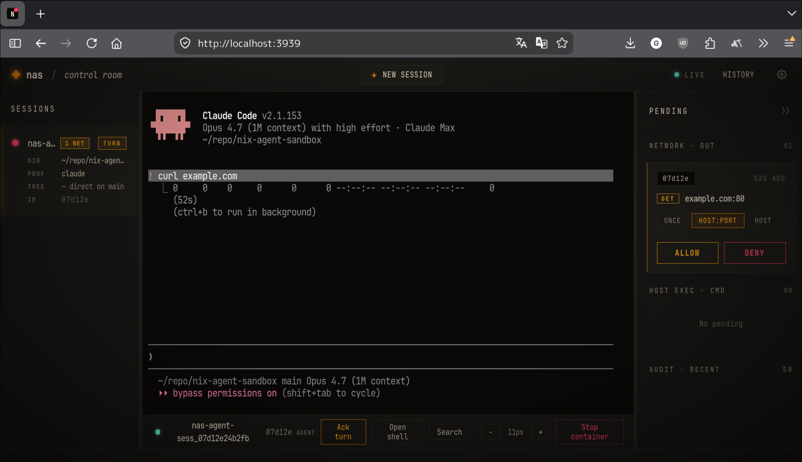
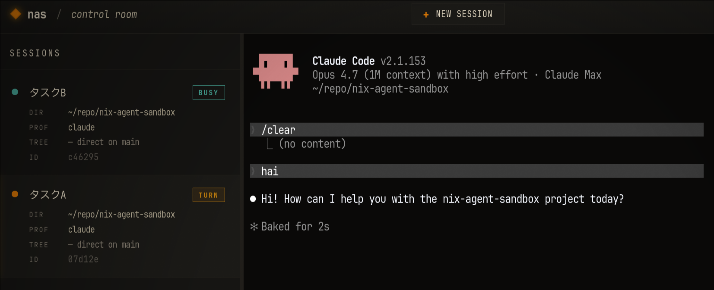

# nas — Nix Agent Sandbox

AI コーディングエージェントを、ホストから隔離された Docker サンドボックスの中で動かすための CLI です。エージェントには Claude Code / GitHub Copilot CLI / OpenAI Codex CLI を選べます。起動した時点ではファイルシステムもネットワークもホストから切り離されており、エージェントが触れてよいものは設定で 1 つずつ opt-in して穴を開けていく、という考え方で作られています。「まず全部塞ぐ。必要な分だけ開ける」が一貫した方針です。

[agent-workspace](https://github.com/hiragram/agent-workspace) にインスパイアされました。

> [!NOTE]
> **名前について**: 当初は Nix 統合を主目的として *nix-agent-sandbox* と命名しました。
> その後、ネットワーク制御・コマンド移譲・Worktree 管理など様々な機能が追加された結果、
> Nix 統合は数ある機能のひとつに過ぎなくなっています。
> この機能が不要な場合は、実行環境に Nix がインストールされている必要もありません。

## インストール

### 前提条件

- Linux
- **エージェントバイナリ** — スタンドアロンバイナリとしてインストール済みであること（npm 版は不可。詳細は[制約・注意事項](#エージェントバイナリ)を参照）
- **Docker** (20.10+)

<details>
<summary>エージェントのインストール</summary>

エージェントは **npm ではなく、公式のスタンドアロンバイナリ** をインストールしてください。

**Claude Code:**

```sh
# 公式インストーラー
curl -fsSL https://claude.ai/install.sh | bash
```

**GitHub Copilot CLI:**

公式のインストール手順に従ってスタンドアロンバイナリを導入してください。

**OpenAI Codex CLI:**

[Releases · openai/codex](https://github.com/openai/codex/releases) からインストールしてください。

</details>

### GitHub Releases からインストール

ビルド済みバイナリを GitHub Releases から取得できます。
x86_64-linux と aarch64-linux を用意していますが、aarch64 は動作未確認です。


```sh
# x86_64-linux
gh release download --repo Hogeyama/nix-agent-sandbox --pattern 'nas-*_x86_64-linux.tar.gz' -O - | tar xz -C ~/.local/bin
nas

# aarch64-linux
gh release download --repo Hogeyama/nix-agent-sandbox --pattern 'nas-*_aarch64-linux.tar.gz' -O - | tar xz -C ~/.local/bin
nas
```

このバイナリは [nix-bundle-elf](https://github.com/Hogeyama/nix-bundle-elf) を使ってビルドされています。
これは実行するたびに自己解凍を行うため、起動に少し時間がかかります。気になる場合は `--extract` オプションで一度展開すると高速化できます。

```sh
gh release download --repo Hogeyama/nix-agent-sandbox --pattern 'nas-*_x86_64-linux.tar.gz' -O - | tar xz -C /tmp/
/tmp/nas --extract /opt/nas
ln -s /opt/nas/bin/nas ~/.local/bin/
```

### ローカルでビルドしてインストール

Nix が使える環境なら、リポジトリから直接インストールもできます。

```sh
nix profile install github:Hogeyama/nix-agent-sandbox
```

## クイックスタート

```sh
cd /path/to/your-project
nas config init                 # .nas/ ディレクトリと設定ファイルを生成
vim .nas/config.pkl             # 設定を編集

nas                             # デフォルトプロファイルで起動
nas copilot-nix                 # プロファイルを指定して起動
nas copilot-nix -p "blah"       # オプションをエージェントに渡して起動
```

`config.pkl` は [Pkl](https://pkl-lang.org/index.html) 形式で、`profiles` の下に用途別の起動設定（プロファイル）を並べる構造です。最小構成なら、使うエージェントと通信を許可するドメインを書く程度で動きます。

```pkl
// .nas/config.pkl
amends "modulepath:/global.pkl"

default = "copilot-nix"

profiles {
  ["copilot-nix"] {
    agent = "copilot"
    network {
      allowlist = new Listing {
        "api.anthropic.com"
        "github.com:443"
        "*.githubusercontent.com:443"
      }
    }
  }
}
```

全フィールドは[設定ファイル](#設定ファイル)を参照してください。

## 機能ガイド

ここでは opt-in できる主な機能をひととおり紹介します。それぞれにどんなリスクが伴うかは[セキュリティについて](#セキュリティについて)で改めて整理します。

### Nix 統合

`nix.enable` を有効にすると、ホストの nix daemon をソケット経由でコンテナから利用できるようになります。コンテナ側に Nix を入れておかなくても、`nix develop` や `nix run` で必要な開発環境やツールをその場でインストールできるのが利点です。

### Docker in Docker

`docker.enable` を有効にすると、DinD サイドカーを立ち上げて隔離された Docker 環境を渡せます。リスクの詳細は[設定により隔離が緩和されるもの](#設定により隔離が緩和されるもの)を参照してください。

### ネットワーク制御

`network.allowlist` を使うと外部への通信を allowlist で制御できます。`"example.com"` のようなホスト名のほか、`"api.example.com:443"` や `"*.cdn.com:8080"` のようにポートやワイルドカードを含む形式も書けます。allowlist に載っていない通信が発生したときは、その場で approve / deny を尋ねられるようにできます。
`ui.enable = true` なら後述するブラウザの UI で判断できます。コマンドラインから承認・拒否する方法は[Network 承認キューの確認と操作](#network-承認キューの確認と操作)を参照してください。

#### 例

通知:


UI上の表示:



### ホストの localhost ポート転送

ホスト側で動かしているローカル開発サーバーや DB に、コンテナの中から `localhost:<port>` でそのまま接続したいというケースがあります。`network.proxy.forwardPorts` を設定すると、Unix domain socket を介してホストに relay することによってこれを実現できます。ホスト側のサービスを `0.0.0.0` で公開する必要はなく、`127.0.0.1` に bind したままコンテナから到達できます。内部機構の詳細と注意点は[設定により隔離が緩和されるもの](#設定により隔離が緩和されるもの)を参照してください。

### コマンド移譲（hostexec）

`hostexec.rules` を設定することで、特定のコマンドだけをコンテナ内ではなくホスト側で実行させることができます。これを使うと、API トークンや署名鍵のような秘匿情報を必要とするコマンドをホストで走らせ、その秘匿情報自体はコンテナに渡さない、という運用ができます。ネットワーク制御と同様に、実行のたびに approve / deny を尋ねることもできますし、ルールで自動許可することもできます。

#### 例

エージェントには `.env` を空で見せつつ……


ホスト側で実行されるコマンドでは `.env` を利用できる。


詳細は[.env を隠しつつ、必要なコマンドはホストに移譲する](#env-を隠しつつ必要なコマンドはホストに移譲する)を参照してください。

### X11 ディスプレイ転送（xpra サンドボックス）

`display.sandbox = "xpra"` を有効にすると、nas はホスト上に [xpra](https://xpra.org/index.html) の detached X server を 1 つ立ち上げます。エージェントから動かせるのはこの仮想 X server 内のアプリだけで、ホスト本体の X セッション（他のウィンドウ・キー入力・スクリーン）には到達できません。

エージェントが描画した X11 アプリケーションのウィンドウは、ユーザの実際のデスクトップに通常のウィンドウとしてポップアップします。

エージェントに `playwright-cli --headed` を実行させ、共同でブラウザを操作するようなユースケースを想定しています。利用には `xpra` と `Xvfb` が必要です。

設定例は[X11 アプリをサンドボックス経由で表示する](#x11-アプリをサンドボックス経由で表示する)、リスクの詳細は[設定により隔離が緩和されるもの](#設定により隔離が緩和されるもの)を参照してください。

### セッション管理（dtach）

`session.multiplex = true` にすると、nas プロセス全体（プロキシ等を含む）が dtach セッション内で起動されます。これにより複数のターミナルから同じセッションに attach でき、detach してもコンテナやプロキシは動き続けます。
このセッションには後述する UI からも attach して操作が可能です。

詳細は[セッションの管理](#セッションの管理)を参照してください。

### Worktree

`nas --worktree <base-branch> <profile>` を実行すると、ベースブランチから `nas/{profile}/{timestamp}` ブランチ付きの git worktree が自動作成されます。
エージェント終了後は、stash、コミットの cherry-pick、ブランチを残して手動で取り込む、などの方法で成果物を回収できます。

<details>
<summary>実行例</summary>

```
$ nas --worktree HEAD claude
[nas] Resolved HEAD to current branch: main
> git -C '/home/hogeyama/repo/nix-agent-sandbox' worktree add -b 'nas/claude/2026-03-17T14-01-57-692Z' '/home/hogeyama/repo/nix-agent-sandbox/.nas/worktrees/nas-claude-2026-03-17T14-01-57-692Z' main
Preparing worktree (new branch 'nas/claude/2026-03-17T14-01-57-692Z')
HEAD is now at d79dcfc

  ... (エージェントが起動し、作業を行う) ...

[nas] Worktree HEAD: 48be913994c4f92ac256d60215b72f0ab9aa1b15
[nas] ⚠ Worktree has uncommitted changes.
[nas] What to do with the worktree?
  1. Delete
  2. Keep
[nas] Choose [1/2]: 1
[nas] Worktree has uncommitted changes.
[nas] How should we handle them before deleting it?
  1. Stash and delete
  2. Delete without stashing
  3. Keep
[nas] Choose [1/2/3]: 1
> git -C '/home/hogeyama/repo/nix-agent-sandbox/.nas/worktrees/nas-claude-2026-03-17T14-01-57-692Z' stash push --include-untracked -m 'nas teardown nas-claude-2026-03-17T14-01-57-692Z 2026-03-17T14:05:33.117Z'
Saved working directory and index state On nas/claude/2026-03-17T14-01-57-692Z: nas teardown nas-claude-2026-03-17T14-01-57-692Z 2026-03-17T14:05:33.117Z
[nas] Stashed worktree changes: nas teardown nas-claude-2026-03-17T14-01-57-692Z 2026-03-17T14:05:33.117Z
[nas] What to do with the branch?
  1. Delete
  2. Cherry-pick to base branch
  3. Rename and keep
[nas] Choose [1/2/3]: 2
[nas] No commits to cherry-pick.
[nas] Removing worktree: /home/hogeyama/repo/nix-agent-sandbox/.nas/worktrees/nas-claude-2026-03-17T14-01-57-692Z
Deleted branch nas/claude/2026-03-17T14-01-57-692Z (was 48be913).
[nas] Deleted branch: nas/claude/2026-03-17T14-01-57-692Z
```

</details>

## 設定ファイル

`nas config init` を実行すると、プロジェクトルートに `.nas/` ディレクトリが作られます。設定は Pkl 形式で、`config.pkl` だけを手で編集すればよく、スキーマやプロジェクト定義は CLI が自動で管理します。ユーザー共通の設定はホームの設定ディレクトリ側に置けます。

```
$XDG_CONFIG_HOME/nas/
├── Schema.pkl          # 型付きスキーマ（CLI が自動管理）
└── global.pkl          # グローバル設定 (amends "Schema.pkl")

.nas/
├── PklProject          # Pkl プロジェクト定義（CLI が自動管理）
├── Schema.pkl          # 型付きスキーマ（CLI が自動管理）
└── config.pkl          # プロジェクトローカル設定 ← これを編集する
```

雛形の `config.pkl` は冒頭が `amends "modulepath:/global.pkl"` になっており、[グローバル設定をベースにプロジェクト設定を上書き](src/config/Schema.pkl)する形でマージされます。プロジェクトごとに独立させたい（グローバル設定を無視したい）場合は、この行を `amends "Schema.pkl"` に書き換えてください。

各フィールドの型・デフォルト値・説明は [`src/config/Schema.pkl`](src/config/Schema.pkl) を参照してください。Pkl IDE 拡張（pkl-lsp）を使えば補完・型チェックも効きます。

<details>
<summary>主要フィールド全部入り config.pkl サンプル</summary>

```pkl
// .nas/config.pkl
amends "modulepath:/global.pkl"

default = "claude"

ui {
  enable = true
  port = 3939
  idleTimeout = 300
}

observability {
  enable = true
}

profiles {
  ["claude"] {
    agent = "copilot"
    agentArgs = new Listing { "--dangerously-skip-permissions" }
    nix {
      enable = "auto"
      mountSocket = true
    }
    docker {
      enable = true # DinDサイドカーを使う
      shared = true # DinDサイドカーを複数コンテナで共有する
    }
    network {
      proxy {
        forwardPorts = new Listing { 8080; 5432 }
      }
      allowlist = new Listing {
        "api.anthropic.com"
      }
      # allowlist に載っていない通信があったときに承認を求めるプロンプトの設定
      prompt {
        enable = true
        timeoutSeconds = 300
        defaultScope = "host-port"
        notify = "auto"
        denyList = new Listing {
          "www.google.com"
        }
      }
    }
    extraMounts = new Listing {
      new { src = "~/.cabal"; dst = "~/.cabal"; mode = "ro" }
      new { src = "/dev/null"; dst = ".env" }  // 相対パスは作業ディレクトリ基準
    }
    env = new Listing {
      new { key = "SOME_VAR"; val = "value" }
      new { key = "ANOTHER_VAR"; valCmd = "cat /path/to/value" }
      new { key = "PATH"; val = "/opt/hoge/bin"; mode = "prefix"; separator = ":" }
    }
    hostexec = new {
      prompt {
        enable = true
        timeoutSeconds = 300
        notify = "auto"
      }
      rules = new Listing {
        new {
          // git commit/tag -S が呼ぶ形 `gpg --status-fd=2 -bsau <keyid>`
          id = "gpg-git-sign"
          match {
            argv0 = "gpg"
            argRegex = "^--status-fd=2 -bsau [0-9A-Fa-f]{8,40}$"
          }
          cwd {
            mode = "workspace-or-session-tmp"
          }
          approval = "allow"
          fallback = "container"
        }
      }
    }
  }
}
```

</details>

## 設定パターン

実運用で頻出する構成をいくつかレシピとして示します。それぞれ展開すると設定例と注意点が見られます。

### .env を隠しつつ、必要なコマンドはホストに移譲する

`.env` を `/dev/null` でマスクしてエージェントから中身を見えなくしつつ、その秘匿情報を要するコマンドだけを hostexec でホストに移譲する、という構成です。

<details>
<summary>設定例</summary>

```pkl
profiles {
  ["blah"] {
    agent = "copilot"
    extraMounts = new Listing {
      new { src = "/dev/null"; dst = ".env" }
      new { src = "package.json"; dst = "package.json"; mode = "ro" }
    }
    hostexec = new {
      secrets {
        ["build_api_token"] { from = "dotenv:.env#API_TOKEN"; required = true }
      }
      rules = new Listing {
        new {
          id = "pnpm-build"
          match { argv0 = "pnpm"; argRegex = "^build\\b" }
          cwd { mode = "workspace-only" }
          env { ["API_TOKEN"] = "secret:build_api_token" }
          approval = "allow"
          fallback = "deny"
        }
      }
    }
  }
}
```

> [!WARNING]
> `deno task` / `npm run` / `make` のような「設定ファイルを読んで実行するコマンド」を hostexec で委譲すると、
> エージェントがその設定ファイルを書き換えることで実質的に任意コマンドのホスト実行が可能になります。
> 本番運用で使う場合は `extraMounts` で設定ファイルを read-only マウントするなどの工夫が必要です。
>
> ```pkl
> extraMounts = new Listing {
>   new { src = "deno.json"; dst = "deno.json"; mode = "ro" }
> }
> ```

</details>

### Git の署名をホストに移譲する

`git commit -S` のような署名操作を、ホスト側の gpg で行わせる構成です。署名鍵をコンテナに渡さずに済みます。

<details>
<summary>設定例</summary>

```pkl
profiles {
  ["blah"] {
    agent = "copilot"
    env = new Listing {
      // hostexec の gpg で署名する
      new { key = "GIT_CONFIG_COUNT"; val = "1" }
      new { key = "GIT_CONFIG_KEY_0"; val = "gpg.program" }
      new { key = "GIT_CONFIG_VALUE_0"; val = "/opt/nas/hostexec/bin/gpg" }
    }
    hostexec = new {
      rules = new Listing {
        // git commit/tag -S が呼ぶ形だけを通す:
        //   gpg --status-fd=2 -bsau <keyid>
        new {
          id = "gpg-git-sign"
          match { argv0 = "gpg"; argRegex = "^--status-fd=2 -bsau [0-9A-Fa-f]{8,40}$" }
          cwd { mode = "workspace-or-session-tmp" }
          approval = "allow"
          fallback = "deny"
        }
        new {
          id = "gpg-default"
          match { argv0 = "gpg" }
          approval = "deny"
          fallback = "deny"
        }
      }
    }
  }
}
```

> [!WARNING]
> `gpg` のような「任意の引数で副作用を起こせるコマンド」を委譲する場合、`--sign` を含むだけ通す
> ような緩い regex は危険です（`--output` で任意ファイル上書き、`--homedir` で keyring 差し替え等）。
> git の呼び出し形 (`gpg --status-fd=2 -bsau <keyid>`) のような完全一致パターンに絞ってください。

</details>

### 相対パスのコマンド（`./gradlew` など）をホストに移譲する

リポジトリ同梱の `./gradlew` のような相対パスのコマンドをホストへ移譲する構成です。

<details>
<summary>設定例</summary>

```pkl
profiles {
  ["android"] {
    agent = "claude"
    hostexec = new {
      rules = new Listing {
        new {
          id = "gradlew"
          match { argv0 = "./gradlew" }
          cwd { mode = "workspace-only" }
          approval = "prompt"
          fallback = "deny"
        }
      }
    }
  }
}
```

> [!NOTE]
> 相対パス `argv0` を指定すると、コンテナ内の該当ファイル（例: `./gradlew`）がラッパースクリプトで bind-mount 置換されます。
> そのためコンテナ内での直接実行にフォールバックできず、`fallback` は `"deny"` のみ利用可能です。

</details>

### `http_proxy` を参照しないツールにプロキシを設定する

JVM ベースのツール（Gradle、Maven など）は `http_proxy` / `https_proxy` を無視するため、JVM システムプロパティでプロキシを明示的に渡す必要があります。

<details>
<summary>設定例</summary>

nas のコンテナ内では `http_proxy` / `https_proxy` が自動設定されますが、JVM ベースのツール（Gradle、Maven など）はこれらの環境変数を無視し、JVM システムプロパティでプロキシを受け取ります。
そのようなツールには `env` でプロパティを明示的に渡してください。nas の Envoy forward proxy はコンテナ内から `localhost:18080` でアクセスできます。

**Gradle**

```pkl
profiles {
  ["android"] {
    agent = "claude"
    env = new Listing {
      new {
        key = "GRADLE_OPTS"
        val = "-Dhttp.proxyHost=127.0.0.1 -Dhttp.proxyPort=18080 -Dhttps.proxyHost=127.0.0.1 -Dhttps.proxyPort=18080 -Dhttp.nonProxyHosts=localhost|127.0.0.1"
      }
    }
  }
}
```

**Maven**

```pkl
profiles {
  ["java"] {
    agent = "claude"
    env = new Listing {
      new {
        key = "MAVEN_OPTS"
        val = "-Dhttp.proxyHost=127.0.0.1 -Dhttp.proxyPort=18080 -Dhttps.proxyHost=127.0.0.1 -Dhttps.proxyPort=18080 -Dhttp.nonProxyHosts=localhost|127.0.0.1"
      }
    }
  }
}
```

</details>

### `cli_auth_credentials_store = "keyring"` な Codex を使う

Codex を keyring 認証で動かすために、DBus session bus 経由で `org.freedesktop.secrets` へ限定的にアクセスを許可する構成です。

<details>
<summary>設定例</summary>

```pkl
profiles {
  ["codex"] {
    agent = "codex"
    dbus {
      session {
        enable = true
        calls = new Listing {
          new { name = "org.freedesktop.secrets"; rule = "org.freedesktop.Secret.Service.OpenSession" }
          new { name = "org.freedesktop.secrets"; rule = "org.freedesktop.Secret.Service.SearchItems" }
          new { name = "org.freedesktop.secrets"; rule = "org.freedesktop.Secret.Item.GetSecret" }
        }
      }
    }
  }
}
```

</details>

### X11 アプリをサンドボックス経由で表示する

`display.sandbox = "xpra"` で、エージェントが起動した X11 アプリをホスト本体の X server から隔離しつつユーザのデスクトップに表示する構成です。`playwright-cli --headed` で共同ブラウザ操作をする、といったユースケース向けです。

<details>
<summary>設定例</summary>

```pkl
profiles {
  ["blah"] {
    agent = "claude"
    display {
      sandbox = "xpra"
      size = "1920x1080"
    }
  }
}
```

> [!NOTE]
> **WSL ユーザー向け**: WSL2 では `/tmp/.X11-unix` がカーネルにより read-only マウントされているため、Xvfb がソケットを作成できません。nas はこの状況を自動検知し、`unshare --user --mount` で private mount namespace を作成して回避します。ソケットの実体はセッションディレクトリ配下に置かれるため、Docker からも問題なくアクセスできます。この回避策は unprivileged user namespace が利用可能な環境で動作します。もし `unshare` が失敗する場合は、`sudo mount -o remount,rw /tmp/.X11-unix` を nas 起動前に実行してください。

</details>

## 運用コマンド

起動後のサンドボックスやセッション、承認キューを操作するためのサブコマンド群です。

### Docker イメージの再ビルド

Docker イメージを再ビルドしたい場合（アップデート後など）は `rebuild` サブコマンドを使います。

```sh
nas rebuild
nas rebuild --force
```

### Worktree の掃除

溜まった worktree を手動で管理するには `worktree` サブコマンドを使います。

```sh
nas worktree list            # nas が作成した worktree を一覧表示
nas worktree clean           # すべて削除（確認プロンプトあり）
nas worktree clean --force   # 確認なしで削除
```

### Sidecar コンテナの掃除

`docker.shared = true` や `network.allowlist` / `network.prompt.enable` を使っていると、DinD / Envoy 関連のコンテナが残ることがあります。未使用のものだけを止めて削除するには `container clean` を使います。

```sh
nas container clean
```

このコマンドは nas が管理する DinD / proxy コンテナのうち、現在どのエージェントコンテナからも使われていないものだけを `stop` + `rm` します。削除後に空になった nas 管理 network と DinD 用 tmp volume もあわせて回収します。現在実行中のエージェントコンテナは対象外です。

### セッションの管理

`session.multiplex = true` のときに使えるセッション管理コマンドです。detach 中のセッションへ別ターミナルから入り直したいときに使います。

```sh
nas session                     # アクティブなセッション一覧（list のエイリアス）
nas session list                # アクティブな dtach セッション一覧
nas session list --format json  # JSON 形式で出力
nas session attach <session-id> # セッションに再接続（複数ターミナルから同時 attach 可能）
```

### Network 承認キューの確認と操作

allowlist 外の通信は承認待ちのキューに積まれます。デスクトップ通知や UI からの操作に加えて、コマンドでも approve / deny できます。

```sh
nas network pending
nas network approve <session-id> <request-id> --scope [once|host-port|host]
nas network deny    <session-id> <request-id>
nas network review
nas network gc
```

- `pending` は `session_id request_id target state created_at` を 1 行ずつ表示します
- `review` は fzf で pending を対話的に選択し approve / deny できます
- `gc` は stale session registry / pending dir / broker socket / auth-router pid/socket を掃除します

### HostExec 承認キューの確認と操作

`approval = "prompt"` のルールにマッチしたコマンドは承認待ちになります。こちらも通知・UI のほか、コマンドで approve / deny できます。

```sh
nas hostexec pending
nas hostexec approve <session-id> <request-id>
nas hostexec deny    <session-id> <request-id>
nas hostexec review
nas hostexec test --profile <profile> -- <command> [args...]
```

- `pending` は `session_id request_id rule_id cwd argv...` を 1 行ずつ表示します
- `review` は fzf で pending を対話的に選択し approve / deny できます
- `test` はルールマッチングを試行し、マッチしたルールの id・approval・env keys を表示します。regex パターンの試行錯誤に便利です

### セッション通知（エージェントフック経由）

エージェントのフックから `nas hook --kind start|attention|stop [--when path=value ...]` を呼び出すと、そのセッションが今どの状態にあるか（「エージェントが作業中」= `busy` / 「ユーザーの入力待ち」= `user-turn` / 「終了済み」= `done`）を UI に伝えられます。複数セッションを並行で回しているときに、どれが手を止めて待っているかを一目で把握するための仕掛けとして用意されています。

各エージェントごとのフック設定例を以下に示します。

<details>
<summary>Claude Code のフック設定（<code>~/.claude/settings.json</code> または <code>.claude/settings.json</code>）</summary>

Claude Code のフック設定は `~/.claude/settings.json`（ユーザー共通）またはプロジェクト直下の `.claude/settings.json` に書きます。設定例:

```jsonc
{
  "hooks": {
    "UserPromptSubmit": [
      { "hooks": [{ "type": "command", "command": "nas hook --kind start" }] }
    ],
    "PreToolUse": [
      { "hooks": [{ "type": "command", "command": "nas hook --kind start" }] }
    ],
    "Notification": [
      { "hooks": [{ "type": "command", "command": "nas hook --kind attention" }] }
    ],
    "Stop": [
      { "hooks": [{ "type": "command", "command": "nas hook --kind attention" }] }
    ],
    "SessionEnd": [
      { "hooks": [{ "type": "command", "command": "nas hook --kind stop" }] }
    ]
  }
}
```

</details>

<details>
<summary>GitHub Copilot CLI のフック設定（<code>.github/hooks/*.json</code>）</summary>

GitHub Copilot CLI では、リポジトリ直下の `.github/hooks/*.json` を読み込みます。設定例:

```json
{
  "version": 1,
  "hooks": {
    "sessionStart": [
      {
        "type": "command",
        "bash": "nas hook --kind start",
        "timeoutSec": 10
      }
    ],
    "userPromptSubmitted": [
      {
        "type": "command",
        "bash": "nas hook --kind start",
        "timeoutSec": 10
      }
    ],
    "preToolUse": [
      {
        "type": "command",
        "bash": "nas hook --kind attention --when toolName=ask_user",
        "timeoutSec": 10
      }
    ],
    "postToolUse": [
      {
        "type": "command",
        "bash": "nas hook --kind start --when toolName=ask_user",
        "timeoutSec": 10
      }
    ],
    "sessionEnd": [
      {
        "type": "command",
        "bash": "nas hook --kind stop",
        "timeoutSec": 10
      }
    ]
  }
}
```

`notification` フックを無条件に `attention` へつなぐと `permission_prompt` なども拾ってしまうため、
この用途では設定しないでください。`--when` はドット区切りの JSON パスに対する完全一致です
（例: `toolResult.resultType=success`）。

</details>

<details>
<summary>OpenAI Codex CLI のフック設定（<code>~/.codex/config.toml</code> または <code>.codex/config.toml</code>）</summary>

OpenAI Codex CLI では、`~/.codex/config.toml`（ユーザー共通）または
リポジトリ直下の `.codex/config.toml` に書きます。設定例:

```toml
[features]
hooks = true

[[hooks.SessionStart]]
matcher = "startup|resume"
[[hooks.SessionStart.hooks]]
type = "command"
command = "sh -c 'test -n \"${NAS_SESSION_ID:-}\" && exec nas hook --kind start || true'"
timeout = 10

[[hooks.UserPromptSubmit]]
[[hooks.UserPromptSubmit.hooks]]
type = "command"
command = "sh -c 'test -n \"${NAS_SESSION_ID:-}\" && exec nas hook --kind start || true'"
timeout = 10

[[hooks.PreToolUse]]
matcher = "*"
[[hooks.PreToolUse.hooks]]
type = "command"
command = "sh -c 'test -n \"${NAS_SESSION_ID:-}\" && exec nas hook --kind start || true'"
timeout = 10

[[hooks.Stop]]
[[hooks.Stop.hooks]]
type = "command"
command = "sh -c 'test -n \"${NAS_SESSION_ID:-}\" && exec nas hook --kind attention || true'"
timeout = 10
```

</details>



## UI daemon

`ui.enable = true` にすると、既に何度か説明に出てきたブラウザ UI が使えるようになります。これは localhost で動く Web インターフェースで、稼働中のセッションをまとめて監視したり、ネットワークや hostexec の承認リクエストをその場で approve / deny したり、コンテナを操作したりするためのものです。

この UI を支える daemon は、セッション開始時に `setsid` で完全にデタッチして起動されるため、起動元の nas プロセスが終了したあとも生き続けます。放置されたまま使われなくなると、`idleTimeout` 経過後に自動停止します（デフォルト 300 秒、`0` で自動停止しない）。

`nas ui` コマンドで手動起動・停止することもできます:

```sh
nas ui                          # config のデフォルト設定で起動
nas ui --port 8080              # ポートを指定
nas ui --idle-timeout 0         # 自動停止しない
nas ui --no-open                # ブラウザを自動で開かない
nas ui stop                     # daemon を停止
nas ui stop --port 8080         # ポートを指定して停止
```

### 信頼境界

UI からは network / hostexec の approve・deny やコンテナ操作など、エージェントへ追加の権限を与える操作ができます。
マルチユーザホストでは別ユーザも approve/deny API を叩けるため、**信頼できない相手とホストを共有している場合は UI daemon を有効にしないでください。**

## セキュリティについて

nas はコンテナ内のファイルシステム変更をホストから隔離しますが、**設定次第ではホストの認証情報やデーモンへのアクセスを許可します**。各機能のリスクを理解した上で有効化してください。

### 機能とリスクの早見表

| 機能 | 概要 | デフォルト | 設定キー | リスク |
|---|---|---|---|---|
| ファイル隔離 | overlay でホスト FS から隔離 | ✅ 常時ON | (なし) | — |
| ネットワーク制御 | allowlist + approve/deny | ✅ 常時制御 | `network.allowlist` / `network.prompt` | 低 |
| Nix 統合 | host nix-daemon を socket 経由で利用 | opt-in | `nix.enable` / `nix.mountSocket` | [🔴 高](#設定により隔離が緩和されるもの) |
| Docker in Docker | 隔離 Docker 環境 | opt-in | `docker.enable` | [🟡 中](#設定により隔離が緩和されるもの) |
| localhost ポート転送 | host loopback ポートへ到達 | opt-in | `network.proxy.forwardPorts` | [🟡 中](#設定により隔離が緩和されるもの) |
| コマンド移譲 (hostexec) | コマンドをホスト実行 | opt-in | `hostexec.rules` | [🔴 高](#設定により隔離が緩和されるもの) |
| X11/xpra 転送 | サンドボックス X server | opt-in | `display.sandbox` | [🟡 中](#設定により隔離が緩和されるもの) |
| DBus 転送 | 許可 service へ到達 | opt-in | `dbus.session.enable` | [🟡 中](#設定により隔離が緩和されるもの) |
| GPG agent 転送 | 署名/復号 | opt-in | `gpg.forwardAgent` | [🔴 高](#設定により隔離が緩和されるもの) |
| 追加マウント | 任意ホストパス | opt-in | `extraMounts` | [🟡 中](#設定により隔離が緩和されるもの) |
| セッション多重化 | dtach で複数 attach | opt-in | `session.multiplex` | — |
| Worktree 管理 | 自動 git worktree | CLI フラグ | `--worktree` | — |
| Web UI daemon | approve / コンテナ操作 UI | opt-in | `ui.enable` | [🟡 中](#設定により隔離が緩和されるもの) |

### デフォルトで隔離されるもの

- **ファイルシステム**: マウントされたディレクトリ／ファイルを除き、コンテナ内の変更は overlay で隔離され、ホストには影響しません
- **プロセス・ネットワーク**: Docker コンテナの標準的な隔離が適用されます

### ネットワーク制御の仕組み（`network.allowlist` / `network.prompt`）

nas は shared Envoy forward proxy、host 上の auth-router、session ごとの broker を使って、エージェントコンテナの外部通信を常に制御します。`network.allowlist` に一致する通信は即時許可され、allowlist 外通信は `network.prompt.enable = true` のときだけ pending になり、無効時は deny されます。

```
session network
├── Agent container   (http_proxy / https_proxy → nas-envoy:15001)
├── shared Envoy      (dynamic forward proxy + ext_authz)
├── auth-router       (host daemon, UDS)
└── DinD sidecar      (有効時のみ同じ session network に attach)
```

- エージェントは資格情報付き proxy URL を通じて Envoy に接続し、`Proxy-Authorization` は auth-router で検証された後に upstream へは除去されます
- `localhost` / loopback / RFC1918 / link-local / ULA など deny-by-default 宛先は broker 前で拒否されます
- `network.prompt.enable = true` のとき、allowlist 外通信は `nas network pending` に現れ、`approve` / `deny` で制御できます
- DinD 有効時、`docker.shared = true` なら既存の共有 DinD サイドカーに session network を attach するだけで、サイドカー自体は再作成されません

### 設定により隔離が緩和されるもの

以下の設定は明示的な opt-in です。有効にするとコンテナからホストリソースへのアクセスが可能になります。

| 設定 | リスク |
|------|--------|
| `nix.mountSocket = true` | ホストの nix-daemon ソケットをコンテナに渡す。nix-daemon 経由で任意のビルド実行・`/nix/store` への書き込み・後続の nix 操作への影響などが可能で、実質的にホストユーザーと同等の権限をコンテナに与えることになる。信頼できないプロジェクト／エージェントで有効化しない |
| `docker.enable = true` | `docker:dind-rootless` サイドカーが `--privileged` で起動される（user namespace セットアップに必要）。エージェントコンテナ自体は非特権のまま。Docker 操作はサイドカー内に隔離され、ホストの Docker デーモンにはアクセスできない |
| `network.proxy.forwardPorts` | 指定した各ポートについて、ホスト `127.0.0.1:<port>` に bind しているサービスへコンテナから直接到達できるようになる（per-port UDS をコンテナへ bind-mount し、コンテナ内の `127.0.0.1:<port>` をホストの同ポートに pipe する）。ホスト側を `0.0.0.0` に晒す必要はないが、認証なしで動かしている開発用 DB・管理 UI・デーモンがあれば、コンテナ内のエージェントがそのままフルアクセスできる点に注意 |
| `dbus.session.enable = true` | 許可した DBus service に対して host 側資産へ到達できる。session bus 全体の露出は減るが、許可先 service の権限そのものは残る |
| `gpg.forwardAgent = true` | ホストの gpg-agent ソケットと公開鍵リング・信頼 DB・設定ファイルがコンテナにマウントされる。agent が unlock されている間はコンテナから任意の署名・復号が可能 |
| `extraMounts` | 指定したホストディレクトリがコンテナにマウントされる（`mode = "rw"` の場合は書き込みも可能） |
| `display.sandbox = "xpra"` | ホスト上に xpra の detached X server (Xvfb backing) を 1 つ起動し、その Xvfb ソケット + per-session cookie のみコンテナへ渡す。nas プロセスが seamless モードの `xpra attach :N` を同時に自動起動するため、エージェントが描画したウィンドウはユーザのデスクトップに通常のウィンドウとして出る。エージェントはこの仮想 X server **内**のアプリに対しては X11 client として全権を持つ（同 server 内のキー入力・画面取得・キー注入は可能）。auto-attach された viewer ウィンドウにフォーカスを当てている間は、ユーザのキー入力やクリップボード内容が viewer 経由でエージェント側のアプリに流れる（X11 アプリを操作する以上避けられない仕様）ため、この仮想 server に別の信頼アプリを同時に attach しないこと。ホスト本体の X server へは到達不可で、そこへのキーロガー・画面キャプチャ・キー注入・クリップボード窃取は構造的に不可能。xpra の control socket は xpra デフォルト (`$XDG_RUNTIME_DIR/xpra/`) に置かれる（ユーザ自身が再 attach/stop に使うだけで機微情報ではない）。xpra/Xvfb 自体に脆弱性があった場合のみホスト権限まで escape する余地あり |
| `hostexec.rules[].inheritEnv.mode = "unsafe-inherit-all"` | host の環境変数が広く継承されるため、secret 漏えい面が大きくなる |

### HostExec の注意点

hostexec ルールで許可したコマンドはホスト側で実行されるため、そのコマンドが持つ能力（任意コード実行経路、任意ファイル I/O、ネットワーク、鍵アクセス等）はそのままエージェントの能力になります。ルールを追加する際は「意図した機能」だけでなく「そのコマンドで他に何ができてしまうか」（全オプション、設定ファイル依存、任意コード実行パス）を把握した上で追加してください。特に `approval = "allow"` は恒久的な貫通口になるため、必要最小限に留めてください。

<details>
<summary>ルール設計時の指針</summary>

- hostexec の入力となるパス（`argv0`、ホスト側 `PATH` に含まれるディレクトリ、委譲先コマンドが参照する設定ファイル 等）は、コンテナから書き込み不能に保たれる必要があります。これが崩れるとエージェントによる書き換えが直ちにホスト任意コード実行に繋がります
  - 相対パス `argv0`（例: `./scripts/foo`）→ 対応する `extraMounts` を `mode = "ro"` に
  - bare name `argv0`（例: `git`）→ ホスト側 `PATH` 上のディレクトリ（`~/.local/bin`, `~/.nix-profile/bin` 等）を `extraMounts` で rw マウントしない
  - 設定ファイルを読むコマンド（`deno task` / `npm run` / `make` 等）→ 当該設定ファイルを `ro` マウントする
- `"allow"` はできる限り避け、`approval = "prompt"` + 絞り込んだ `argRegex` を既定とする
- `bash -lc` / `sh -c` / `python -c` のような任意コード実行に直結する委譲はルール化しない
- `"unsafe-inherit-all"` は互換性用の escape hatch。通常は `"minimal"` + `inheritEnv.keys` を使う

</details>

<details>
<summary>特に注意すべきコマンドカテゴリ</summary>

- **テスト・ビルドランナー**（`bun test`, `npm test`, `make`, `cargo` ...）: 定義上、テスト・ビルドファイル経由で任意コード実行
- **言語ランタイム**（`python`, `node`, `ruby`, `deno` ...）: `-c` / スクリプト引数で任意コード実行
- **ローカルに HTTP サーバを立てるツール**（静的ファイルサーバ / live-reload プレビュー / API モック 等）: `--bind` で非-loopback、あるいは `--port` を `network.proxy.forwardPorts` と衝突させると、コンテナからホスト任意ファイルが読める経路になる
- **`gpg`**: `--output` 系オプションでホスト任意パスへの書き込みが可能。`argRegex` で意図した最小フォーマット（例: git の署名だけ許すなら `^--status-fd=2 -bsau [0-9A-Fa-f]{8,40}$`）に絞ること
- **エディタ**（`vim`, `nvim`, `emacs` ...）: `:!` / 設定ファイルから任意コマンド起動
- **ネットワークツール**（`curl`, `wget`, `ssh` ...）: 任意 I/O。`ssh` は `ProxyCommand` 経路でシェル実行
- **`git`**: 引数内 alias 定義（`-c 'alias.x=!cmd'`）で任意シェルが走る。`git push` 等をピンポイントで deny するより、「想定の sub-command パターンに match する prompt ルール」の方が安全
- **パッケージマネージャ**（`npm install`, `pip install`, `cargo install` ...）: post-install / build スクリプトによる任意コード実行
- **プロセス置換系**（`env`, `xargs`, `find -exec`, `rg --pre` 等）: 結局別のコマンドに橋渡しする構造なので arg 制約が必須

</details>

<details>
<summary>マッチ仕様と周辺の挙動</summary>

- `argv0` には bare name（`git`）、絶対パス（`/usr/bin/git`）、相対パス（`./scripts/foo`）を指定できます
  - bare name: PATH 上のラッパーシンボリックリンクで委譲
  - 絶対パス・相対パス: `LD_PRELOAD` による `execve` インターセプトで委譲
- `argRegex` は引数をスペースで join した文字列に対してマッチします。そのためスペースを含む単一引数（例: `git commit -m "hello world"` の `"hello world"`）と複数引数の区別はできません。実用上、コマンド識別に使う先頭引数やフラグにスペースが含まれることは少ないため問題になることは多くないですが、引数の値そのものに依存するマッチパターンを書く場合は留意してください
- エージェント設定ディレクトリ（`~/.claude/` / `~/.copilot/` / `~/.codex/`）は存在すれば常にマウントされるため、これらに認証トークンが置かれている場合は hostexec を制限してもコンテナ内からアクセス可能です

</details>

### 常にマウントされるもの

- **エージェントの設定**: ホスト上に存在する場合のみ、Claude Code は `~/.claude/`、Copilot CLI は `~/.copilot/`、OpenAI Codex CLI は `~/.codex/` がコンテナに渡されます。

### 推奨事項

- `.nas/config.pkl` ではまず最小限の設定から始め、必要に応じて機能を追加してください
- `docker.enable` は Docker-in-Docker が必要な場合のみ有効にしてください（DinD rootless サイドカーが起動されます）
- クラウド認証情報のマウントは、エージェントにクラウドリソースへのアクセスが必要な場合のみ有効にしてください

## 制約・注意事項

### エージェントバイナリ

- **npm でインストールされたエージェントは動作しません。** npm 版は `node_modules/` ツリー全体に依存するため、単一ファイルのバインドマウントでは起動できません。必ず公式のスタンドアロンインストーラーを使ってください。

### ファイル所有権

- コンテナ内のエージェントプロセスは、ホストユーザーと同じ UID/GID で実行されます。作成・変更されたファイルはホストユーザー所有になります。
- entrypoint は root で起動し（overlay セットアップ等）、エージェント起動前にホスト UID にドロップします。

### TTY

- インタラクティブモード（引数なしでエージェントを起動）には TTY が必要です。
- CI/スクリプトなど非 TTY 環境では `nas copilot -p "プロンプト"` のように profile 名の後ろへ直接引数を渡すか、デフォルトプロファイルを使う場合は `-- -p "プロンプト"` を使ってください。

### Docker

- `docker.enable = true` は `docker:dind-rootless` サイドカーを起動します。サイドカーは `--privileged` で起動されますが、エージェントコンテナは非特権のままです。Docker 操作はホストから隔離されます。
- ビルドキャッシュは Docker named volume (`nas-docker-cache`) に永続化されます。`docker volume rm nas-docker-cache` でクリアできます。

### Nix 固有

- ホストに nix がインストールされ、nix-daemon が動作している必要があります。
- ホストの `/nix` ディレクトリ全体がコンテナにマウントされます。

## 設定リファレンス

全フィールドの型・デフォルト値・説明は [`src/config/Schema.pkl`](src/config/Schema.pkl) を参照してください。
