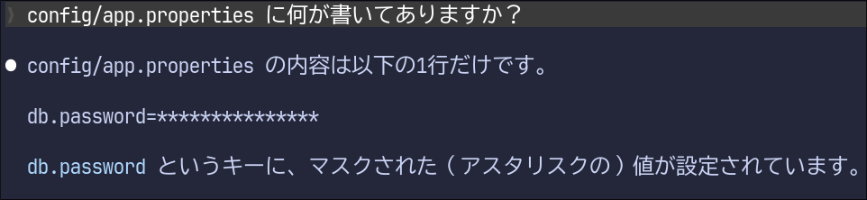
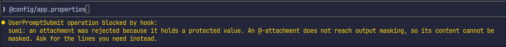

# sumi

sumi は、Claude Code にシークレットを読ませないためのツールです。墨消しの墨から取っています。

例えば `config/app.properties` というファイルに `db.password=Tr0ub4dor` というシークレットが入っているとします。
sumi を設定すると、Claude Code には `db.password=*********` と見えるようになります:



マスクは `Read`、`Grep`、`Bash` などの各種ツールが対象です。
ただし、[保護できない経路や値の形式](#守らないもの)もあるため、利用前に確認してください。

## クイックスタート

### インストール

配布バイナリを使う場合、x86_64 Linux では次のようにインストールします。aarch64 Linux では URL のファイル名を `sumi-aarch64-linux` に替えてください。

```bash
mkdir -p ~/.local/bin
curl -fsSLo ~/.local/bin/sumi https://github.com/Hogeyama/nix-agent-sandbox/releases/latest/download/sumi-x86_64-linux
chmod +x ~/.local/bin/sumi
```

### シークレットファイルの作成

任意の場所にパーミッション0600でシークレットファイルを作成します。例:

```
mkdir -p ~/.claude/sumi
[ -e ~/.claude/sumi/secrets.txt ] || install -m 600 /dev/null ~/.claude/sumi/secrets.txt
${EDITOR:-vi} ~/.claude/sumi/secrets.txt
```

シークレットファイルには改行区切りでマスクしたいシークレットを列挙します。


```~/.claude/sumi/secrets.txt
Tr0ub4dor
mYImP0rTaNTpaSS
...
```

> [!NOTE]
> 制限として、各値は 4 バイト以上、全体で 1024 件以下にする必要があります。

### Claude Codeの設定を生成

下記の `sumi init` コマンドを実行すると、`~/.claude/settings.json` にマスク用の hooks と環境変数 `CLAUDE_CODE_SHELL{,_PREFIX}` が追加されます。

```
~/.local/bin/sumi init --agent claude --secrets-file ~/.claude/sumi/secrets.txt
```

変更前の設定は同ディレクトリ内にバックアップされるようになっています。
設定が完了したら、Claude Code を起動すると、マスクが有効になります。

## リミテーション

sumi は下記の限界があります。これが許容できない場合はより強力なシークレット保護を提供する nix-agent-sandbox 本体の利用を検討してみてください。

### マスクの代わりに拒否となるケース

以下の場合、マスクの代わりに拒否されます。

* プロンプト内で `@config/app.properties` のようにシークレットを含むファイルを読もうとしたとき
  
* `@` 指定のパスを解決できず、内容を確認できなかったとき
  * 拡張子の長さや有無にかかわらず拒否します

Claude Code の `--add-dir` を使う場合は、同じディレクトリを `sumi init` の `--root DIR` にも指定してください。複数ある場合は `--root` を繰り返します。

### マスクも拒否もできないケース（すり抜けてしまうケース）

* Bash以外のツールがシークレットを出力しながら失敗したとき
* 可逆な方法でシークレットがエンコードされたとき
  * 例: `base64 config/app.properties`
    * `base64`くらいであればシークレットファイルにエンコード後の値を書き込むことで回避できます
* `CLAUDE.md`など hook が使われない経路で読まれる情報にシークレットが含まれるとき
* hook が無効化されたとき
  * Claude Codeが入れ子で `claude --bare` や `claude --settings '{"disableAllHooks":true}'` を実行するケースや
  * Claude Codeが `settings.json` を編集するケース

## sumi を外す

Claude Code を終了し、`init` が更新した設定ファイルを編集します。通常は `~/.claude/settings.json`、`CLAUDE_CONFIG_DIR` を設定していた場合はそのディレクトリの `settings.json` です。`--settings` を指定していた場合は指定したファイルを編集します。`hooks` 内の `PostToolUse`、`PostToolUseFailure`、`UserPromptSubmit` から、sumi を実行する hook を削除してください。

`env` 内の `CLAUDE_CODE_SHELL_PREFIX`、`CLAUDE_CODE_SHELL` も削除します。導入前に値が設定されていた項目は、バックアップにある元の値へ戻してください。
