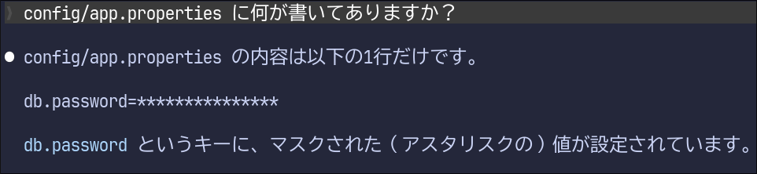
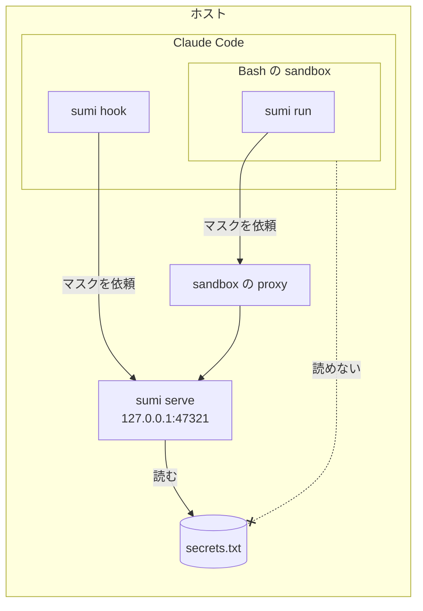
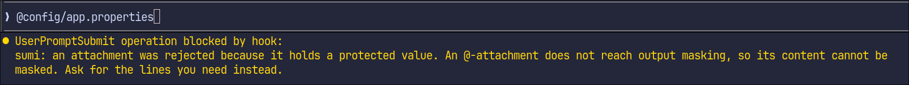

# sumi

sumi は、エージェントへ渡すツール出力からシークレットを伏せるツールです。墨消しの墨から取っています。

例えば `config/app.properties` というファイルに `db.password=Tr0ub4dor` というシークレットが入っているとします。
sumi を設定すると、Claude Code には `db.password=*********` と見えるようになります:



マスクは `Read`、`Grep`、`Bash` などの各種ツールが対象です。
ただし、[保護できない経路や値の形式](#リミテーション)もあるため、利用前に確認してください。

## クイックスタート

### インストール

配布バイナリを使う場合、x86_64 Linux では次のようにインストールします。aarch64 Linux では URL のファイル名を `sumi-aarch64-linux` に替えてください。

```bash
mkdir -p ~/.local/bin
curl -fsSLo ~/.local/bin/sumi https://github.com/Hogeyama/nix-agent-sandbox/releases/download/sumi-latest/sumi-x86_64-linux
chmod +x ~/.local/bin/sumi
```

この URL は常に最新の sumi を指すので、更新するときも同じコマンドを実行してください。インストール済みのバージョンは `sumi --version` で、変更点は [CHANGELOG](CHANGELOG.md) で確認できます。
特定のバージョンに固定したい場合は、URL の `sumi-latest` を `sumi-v0.1.0` のようなタグに替えてください（sumi は nas 本体とは別に `sumi-v*` タグでリリースしています）。

### シークレットファイルの作成

任意の場所にパーミッション0600でシークレットファイルを作成します。例:

```
mkdir -p ~/.claude/sumi
[ -e ~/.claude/sumi/secrets.txt ] || install -m 600 /dev/null ~/.claude/sumi/secrets.txt
${EDITOR:-vi} ~/.claude/sumi/secrets.txt
```

シークレットファイルには改行区切りでマスクしたいシークレットを列挙します。


```~/.claude/sumi/secrets.txt
Tr0ub4dor
mYImP0rTaNTpaSS
...
```

> [!NOTE]
> 制限として、各値は 4 バイト以上、全体で 1024 件以下にする必要があります。

値が base64 で書かれている場合（Kubernetes の Secret からコピーした値など）は、復号した値も伏せます。
例えば `VHIwdWI0ZG9y` と書けば、`VHIwdWI0ZG9y` と `Tr0ub4dor` の両方が対象になります。
対象になるのは、パディング込みで長さが 4 の倍数の正準な base64（標準・URL-safe のどちらでも）で、復号値が 4 バイト以上になる行だけです。
`echo x | base64` のような末尾の改行は取り除きます。
条件を満たさない行は、そのまま通常の値として扱います。

> [!WARNING]
> 偶然この条件を満たす値（例: `dGVzdA==` は `test` の base64）を書くと、復号値も伏せられ、それを含むプロンプトは拒否されます。

### Claude Codeの設定を生成

下記の `sumi init` コマンドを実行すると、`~/.claude/settings.json` にマスク用の hooks と環境変数 `CLAUDE_CODE_SHELL{,_PREFIX}` が追加されます。

```
sumi init --agent claude --secrets-file ~/.claude/sumi/secrets.txt
```

変更前の設定は同ディレクトリ内にバックアップされるようになっています。
設定が完了したら、Claude Code を起動すると、マスクが有効になります。

## 発展的な使い方

### シークレットファイルを隠す構成

クイックスタートの方法では、`sumi` の実行時にシークレットファイルが読み込み可能である必要があり、敵対的なエージェントはシークレットファイル自体を盗むことができてしまいます。
`sumi` は、Claude Code の [sandbox](https://docs.claude.com/en/docs/claude-code/sandboxing) などの隔離機構と組み合わせて、シークレットファイルを隠す構成をサポートしています。


```mermaid
flowchart LR
  subgraph host["ホスト"]
    subgraph claude["Claude Code"]
      hook["sumi hook"]
      subgraph sandbox["Bash の sandbox"]
        run["sumi run"]
      end
    end
    proxy["sandbox の proxy"]
    serve["sumi serve<br/>127.0.0.1:47321"]
    secrets[("secrets.txt")]
  end

  hook -- "マスクを依頼" --> serve
  run -- "マスクを依頼" --> proxy --> serve
  serve -- "読む" --> secrets
  sandbox -. "読めない" .-x secrets
```

シークレットファイルを読むのは、ホストで動かす `sumi serve` だけにします。
hook と、Bash のコマンドを包む `sumi run` は、シークレットファイルの代わりに `sumi serve` へマスクを依頼します。
Bash のコマンドは sandbox の中で動くので、sandbox の設定でシークレットファイルを読めなくしておけば、エージェントからは読めません。
sandbox の中から `sumi serve` へは、sandbox の proxy を通して届きます。

#### 1. `sumi serve` を起動する

```
sumi serve --secrets-file ~/.claude/sumi/secrets.txt --listen tcp://127.0.0.1:47321
```

`sumi serve` は kill するまで動き続けます。ポート番号は空いている番号を選んでください。手順 3 の設定にも同じ番号を書きます。

> [!NOTE]
> * シークレットファイルを変更すると、`sumi serve` は次の接続から新しい内容を使います。すでに動いているコマンドには反映されません。
> * 変更後の内容を読めないとき (ファイルが空、形式が正しくないなど) は、それまでの内容を使い続け、`sumi serve` の stderr に警告を出します。
> * 信頼できないユーザーと共有するマシンではこの構成は避けて、[Dev Container版](#dev-container-で使う)を検討してください。

#### 2. Claude Code の設定を生成する

`--secrets-file` の代わりに `--server` を指定して `sumi init` を実行します。

```
sumi init --agent claude --server tcp://127.0.0.1:47321
```

#### 3. sandbox を有効にし、シークレットファイルを隠す

`~/.claude/settings.json` に次を足します。

```jsonc
{
  "sandbox": {
    "enabled": true,
    "allowUnsandboxedCommands": false,
    "network": { "allowedDomains": ["127.0.0.1:47321"] },
    "filesystem": { "denyRead": ["~/.claude/sumi/secrets.txt"] }
  },
  "permissions": {
    "deny": ["Read(~/.claude/sumi/secrets.txt)"]
  }
}
```

* `network.allowedDomains` には、手順 1 のポートだけを書きます。sandbox の中の `sumi run` はここを通って `sumi serve` に届きます。
* `filesystem.denyRead` は Bash のコマンドからシークレットファイルを隠します。
* `permissions.deny` は Read ツールなどからシークレットファイルを隠します。sandbox は Bash のコマンドにしか効かないので、こちらも必要です。
* `allowUnsandboxedCommands: false` で、エージェントが sandbox の外でコマンドを実行する逃げ道を塞ぎます。

#### Dev Container で使う

Dev Container の中で Claude Code を動かす場合は、TCP の代わりに Unix ソケットも使えます。

ホストで `sumi serve` を Unix ソケットで起動し、ソケットのあるディレクトリだけをコンテナに mount します。ディレクトリが無ければ、`sumi serve` が権限 0700 で作ります。

```
sumi serve --secrets-file ~/.claude/sumi/secrets.txt --listen "$XDG_RUNTIME_DIR/sumi/mask.sock"
```

```jsonc
// devcontainer.json
{
  "mounts": [
    "source=${localEnv:XDG_RUNTIME_DIR}/sumi,target=/run/sumi,type=bind,readonly"
  ]
}
```

コンテナ内にも[インストール](#インストール)の手順で sumi を入れ、次を実行します。

```
sumi init --agent claude --server /run/sumi/mask.sock
```

> [!NOTE]
> * ソケットファイルではなく、ディレクトリを mount する必要があります。`sumi serve` を再起動するとソケットが作り直され、ファイル単体の mount は古いソケットを指したままになるためです。
> * ディレクトリは読み取り専用で mount します。コンテナ内のエージェントが `mask.sock` を消して、マスクしない自前の待ち受けに差し替えるのを防ぐためです。
> * ソケットは 0600 で作られます。コンテナのユーザーの UID を、`sumi serve` を起動したホストのユーザーと合わせてください。

## リミテーション

sumi は下記の限界があります。これが許容できない場合はより強力なシークレット保護を提供する nix-agent-sandbox 本体の利用を検討してみてください。

### マスクの代わりに拒否となるケース

以下の場合、マスクの代わりに拒否されます。

* プロンプト内で `@config/app.properties` のようにシークレットを含むファイルを読もうとしたとき
  
* `@` 指定のパスを解決できず、内容を確認できなかったとき
  * 拡張子の長さや有無にかかわらず拒否します

### マスクも拒否もできないケース（すり抜けてしまうケース）

* `CLAUDE.md`など hook が使われない経路で読まれる情報にシークレットが含まれるとき
* シークレットがエンコードされたとき
  * 単純なbase64やquoteには対応していますが、2重でbase64
* hook が無効化されたとき
  * Claude Codeが入れ子で `claude --bare` や `claude --settings '{"disableAllHooks":true}'` を実行するケースや
  * Claude Codeが `settings.json` を編集するケース
* HTTP MCPがシークレットを出力しながら失敗したとき

## sumi の設定を削除する

Claude Code を終了し、`init` が更新した設定ファイルを編集します。通常は `~/.claude/settings.json`、`CLAUDE_CONFIG_DIR` を設定していた場合はそのディレクトリの `settings.json` です。`--settings` を指定していた場合は指定したファイルを編集します。`hooks` 内の `PostToolUse`、`PostToolUseFailure`、`UserPromptSubmit` から、sumi を実行する hook を削除してください。

`env` 内の `CLAUDE_CODE_SHELL_PREFIX`、`CLAUDE_CODE_SHELL` も削除します。導入前に値が設定されていた項目は、バックアップにある元の値へ戻してください。

## ライセンス

sumi は MIT License で配布しています（リポジトリの [LICENSE](../../LICENSE)）。配布バイナリには Zig の標準ライブラリと musl libc が静的にリンクされています。これらを含む著作権・許諾表示は `sumi --licenses` で表示できます。
