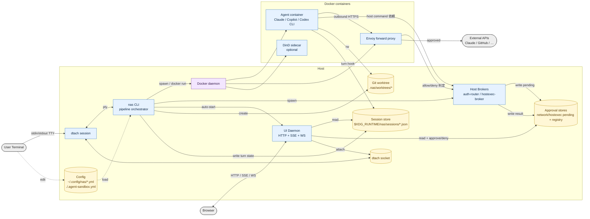

# データフロー図（全体俯瞰）

プロセス単位 + データストアの粒度で、`nas` 実行時に動いているものと、それらがやり取りするディスク上の状態を示す。

凡例:
- 四角 (`[...]`): プロセス / 実行ユニット
- 円柱 (`[(...)]`): データストア（ファイル・ソケット・ボリューム）
- 破線: 設定ファイルの読み込みなど参照系
- 実線: ランタイムのデータフロー

## プロセス一覧（最上位）

| プロセス | 起動契機 | 主な役割 |
|---|---|---|
| nas CLI | ユーザーが `nas [profile]` 実行 | config を読み、pipeline で各コンテナ・デーモンを組み立てる |
| dtach session | `session.multiplex: true` のとき CLI が自己ラップ | 複数ターミナルからの attach を可能にする |
| UI Daemon | `ui.enable: true` で CLI が auto-start、または `nas ui` | HTTP/SSE/WS でダッシュボードを配信、承認操作を受ける |
| Host Brokers (auth-router / hostexec-broker) | pipeline stage で起動 | 外向き通信・ホストコマンド実行の承認窓口 |
| Agent container | launch stage | Claude Code / Copilot CLI / Codex CLI 本体が走る |
| Envoy forward proxy | proxy stage（`network.prompt.enable`） | Agent の外向きトラフィックを allowlist/承認で制御 |
| DinD sidecar | `docker.enable: true` | Agent 内から使える rootless Docker |
| Docker daemon | 常駐（外部） | すべてのコンテナライフサイクル |

## データストア一覧（最上位）

| ストア | 書き手 | 読み手 | 目的 |
|---|---|---|---|
| Config YAML | ユーザー | CLI / services | プロファイル定義・各機能の有効化 |
| Session store | CLI / Agent hooks | UI / CLI | turn state（user-turn / agent-turn / done） |
| Approval stores (network + hostexec) | Agent → Brokers | UI / CLI / Brokers | 承認待ちリクエストと承認履歴 |
| dtach socket | dtach | User terminal / UI | セッション多重化 |
| Git worktree | CLI（`--worktree`） | Agent | ブランチ隔離された作業領域 |

## 意図的に省略したもの

1枚絵としての可読性を優先し、以下は別ドキュメントに分離する予定:

- pipeline 内の各 stage（mount / dbus-proxy / nix-detect など）の個別フロー
- UI ↔ backend の具体的なエンドポイント・SSE チャネル設計
- Envoy 設定生成や nix-daemon socket bind mount の詳細
- 各ストアの JSON スキーマ
