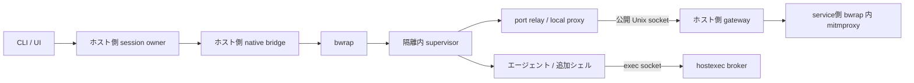

# bwrap バックエンドの段階導入

Status: 保留（2026-09-12、ユーザー判断）。専用 Docker と Testcontainers の基本動作は実証できたが、現在の用途では導入・保守コストに見合う効果が明確でないため、検討をここで終了する。実装には進まない。再開時は起動速度・セットアップ負担などの導入効果を評価し、要件と設計を見直す。以下の本文は検討時点の記録として残す。

> **前提変更・実行保留:** ホスト環境の継承と、セッション専用 Docker による承認不要の Testcontainers 実行が必要。本文の Ubuntu rootfs 配布、Nix/devShell・DinD 非対応はこの用途を満たさないため再設計対象。32–45 コミットは新要件の見積りとして使用しない。[成立性の再検討](../notes/2026-09-11-bwrap-testcontainers-feasibility.md)を参照。

対象: `0cb5eb21` の検討メモ。コード確認の基準は `6b152b9b`。
対応する [実装計画](../plans/2026-09-11-bwrap-backend.md)。

## この設計で決めたいこと

**必須条件: nas は Nix なしでも使える。bwrap バックエンドも Nix/Docker なしで取得・起動・運用できる設計にする。**
Docker デーモンを必須にせず nas のエージェントを起動できるようにする。
Docker バックエンドを既定のまま保ち、Linux 向けに明示選択の bwrap バックエンドを追加する案を承認するか判断する。
実装者向けに、隔離境界、既存機能の扱い、実証が必要な条件を示す。2 名の subagent とコードを照合し、[実現可能性レビュー](../notes/2026-09-11-bwrap-feasibility-review.md) の修正を反映した。コマンドの利用者向け手順は実装時にユーザーガイドへ置く。

**推奨:** CI で構成して配布する専用 Ubuntu rootfs、隔離 netns、Unix socket 経由の proxy、サンドボックス内 supervisor を組み合わせる。
`docker.enable = true` は bwrap では起動前エラーにする。Docker に自動フォールバックしない。
Nix は任意の nas インストール手段に留め、runtime は配布 archive から取得する。エージェント内の Nix/devShell 構築は初期版では非対応とする。選択した profile の `nix.enable = false` を要求する。

今回の到達点は「Docker なしで実際のエージェントを使え、追加シェルと port relay を同じ隔離境界で動かせる実験的バックエンド」。Docker の削除、既定変更、bwrap 内 DinD は別の判断とする。

## 元メモの再評価

| 元メモの前提 | 確認結果と設計への影響 |
| --- | --- |
| `ContainerPlan` をそのまま翻訳できる | `src/pipeline/state.ts` の `image`、`NetworkAttachment`、`extraRunArgs` は Docker 固有。`LaunchOpts` も `DockerRunOpts` の別名。共通の実行意図と backend 固有の設定を分ける必要がある。 |
| launch service の裏だけ差し替える | `src/cli.ts` は launch より前に DockerBuild/Proxy/Dind ステージを組む。起動前処理も分岐しないと Docker 不要にならない。 |
| bwrap は lo を up にしない | 0.11.2 は `loopback_setup()` を呼び、`network.c` は `IFF_UP` を設定する。エージェントへ `CAP_NET_ADMIN` を渡す案を撤回する。[実装](https://github.com/containers/bubblewrap/blob/v0.11.2/bubblewrap.c#L3067-L3069)、[network.c](https://github.com/containers/bubblewrap/blob/v0.11.2/network.c#L127-L186)。 |
| 同 UID なら nsenter で exec 相当になる | 同 UID だけでは成功も同等の隔離も保証しない。user/mount namespace の権限、root/cwd、環境、seccomp の再適用が必要。初期方式に採らない。[setns(2)](https://man7.org/linux/man-pages/man2/setns.2.html)。 |
| ホスト `/` の ro bind を軽量オプションにする | ro は読み取りを禁止しない。秘密ファイルと control socket を隠す C1/C2 を満たす初期方式にしない。 |
| PID を記録すれば GC を置換できる | PID 再利用、再起動、途中失敗、dtach 切断を扱う所有者と状態遷移が必要。Docker ラベルとは別の registry を持つ。 |
| bash.real のコピーが消える | コピーを不要にすることは可能だが、wrapper の shebang と exec 先に実 Bash の別パスは必要。配布 rootfs 内に保持した真の Bash の別パスを参照する。 |
| Nix buildEnv にパッケージを移せば rootfs 完了 | `/bin`、`/etc`、CA、NSS、動的ライブラリ、writable home/tmp、既存 entrypoint の環境設定も構成する。 |

このコンテナで bwrap 0.11.2 の namespace 作成が権限エラーになることは確認した。
エラーだけから seccomp、AppArmor、sysctl のどれが原因かは断定しない。ホストでの成功、FUSE、Chromium、nsenter は未検証。
起動速度の数値も未計測であり、ミリ秒単位になるとは約束しない。

## ライセンスと配布の条件

ユーザーの指摘を受け、ライセンス対応を配布設計の必須条件にする。nas 本体の MIT 表示を rootfs 全体のライセンスとして扱わない。

dtach は上流の [dtach.h](https://github.com/crigler/dtach/blob/master/dtach.h) で GPL-2.0-or-later と明記されている。
現行の `src/dtach/client.ts` は外部コマンドを spawn し、`flake.nix` の release bundle に dtach は明示同梱されていない（devShell の依存には含む）。初期 bwrap でも dtach は利用者が導入するホスト依存として維持する。
guardian に dtach のコードを取り込まない。既存 native コードの再利用時も出自・ライセンスを確認する。外部プログラム呼出、同梱、リンク、コード転用を混同しない。

rootfs に含む他の GPL/LGPL 等の再配布条件は別途残る。[GPLv2 §2–3](https://github.com/crigler/dtach/blob/master/COPYING) は独立した著作物の集合と executable 配布時の対応ソース提供等を区別している。実際に配布する組合せ・リンク方法ごとに適用条件を確認する。

| 配布対象 | 初期方針 |
| --- | --- |
| dtach、host bwrap、fusermount3 | host の外部依存。nas/rootfs archive へ混入させない。配布を追加するなら別途条件を確認する。 |
| Ubuntu base/apt package、Bun、Python wheel と内包 library、フォント | 正確な version/architecture/digest/取得元/ライセンス/対応 source をビルド時に記録する。不要な Docker CLI/compose と未対応 GUI package は runtime から外す。 |
| guardian/extractor/maskfs と bundled library | 自作部分と第三者部分を分離して表示。libarchive を含むリンク先の条件を確認し、LGPL 等では source だけでなく置換・再リンクに必要な条件も確認する。 |
| agent 本体とユーザーの host tool | 初期 runtime には再配布せず host から明示 mount。ABI 試験に使ったバイナリを release に混入させない。 |

release は SBOM、`LICENSES/`、著作権/NOTICE、binary digest と source artifact の対応表を持つ。必要な対応ソース、distro patch、build/install script は同じ release から提供する。
上流 URL の一覧や SBOM だけを対応ソース提供の代わりにしない。Ubuntu package は実バイナリに対応する source package を確保し、直接ダウンロードや Python wheel 内の依存も調べる。
利用時に source archive のダウンロードは必須にしないが、binary と同じ release から取得可能にする。必要資料が揃わない component があれば release を失敗させる。

## 利用条件と互換性

設定はトップレベルの `sandbox.backend = "docker" | "bwrap"` を追加し、未指定は `"docker"` とする。
既存の `docker.enable` は DinD の設定として維持する。bwrap 選択時の host 依存は distro 等から導入した bwrap と、利用機能に必要な FUSE/dtach 等の既存依存。nas・guardian・extractor・maskfs の host 実行バイナリは Nix なしで動く release bundle として供給する。初期検証基準の bwrap は 0.11.2 とする。
バージョン番号だけで起動可否を判断せず、利用するバイナリで namespace の能力検査を行う。
Nix なしの tarball 利用者も Docker/bwrap を選択できる。CI のビルド手段として Nix/Docker を使うことは、利用時依存を意味しない。

| 機能 | bwrap 初期リリースの契約 |
| --- | --- |
| workspace、extraMounts、設定ファイル ro、環境操作 | 維持。未対応の Docker 固有オプションは明示エラー。 |
| hostexec、mask-filter、maskfs | 必須。秘密を見せない境界とマスク不能時の出力抑止を維持。 |
| proxy、認証・承認・監査、CA | 必須。許可外通信を許容する縮退はしない。 |
| 追加シェル、dtach attach、list/stop/clean | 必須。backend を識別して処理する。 |
| network bind/forward、OTLP | 必須。Unix socket 経路を使う。 |
| xpra、dbus、gpg | 有効な設定を黙って無視しない。各機能のホスト受入試験合格までは起動前に非対応エラーとする。 |
| Nix/devShell の自動構築 | 初期版非対応。`nix.enable = false` を要求し、Nix daemon は公開しない。plain direnv は隔離内で実行する。 |
| DinD、任意 Docker イメージ・Docker 実行引数 | bwrap では非対応。起動前に該当項目と Docker 選択方法を示す。 |

トップレベルで `sandbox.backend = "bwrap"` を指定し、選択 profile の `docker.enable = false` と `nix.enable = false` を設定する。`nix.enable = false` のとき `nix.mountSocket` は従来同様無効なので、既定の true だけを理由に拒否しない。Pkl schema と TypeScript の既定値を一致させる。
機能の非対応検査は、CA 生成、daemon 起動、session 登録より前に実施する。`src/cli.ts` の pipeline 外にある `resolveBuildProbes` と `ensureUiDaemon` より前に backend を分岐する。

## プロセスと通信の構成

owner は nas のセッションを実行するホストプロセス。multiplex 有効時は dtach 配下の nas がこの役を担う。
CLI/UI はホスト専用 control socket で owner に要求する。socket と registry はホスト専用の 0700 ディレクトリに置く。
Bun owner とホスト側 native bridge は長さ付き stdio frame で通信する。bridge が bwrap の直接の親となり、隔離内 supervisor と socketpair で通信する。bridge は guardian を兼ね、PTY/SCM_RIGHTS/pidfd とセッション専用 host 子プロセス・runtime directory の回収を扱い、子コマンドには制御 FD を継承させない。
Bun での SCM_RIGHTS 受信を前提にしない。bridge は受信 FD の個数と PTY 型を検証し、未知の ancillary data と余分な FD は close して拒否する。data/control frame は種別と長さを検証し、stdin/stdout の backpressure を伝達する。
追加シェルは supervisor の子として fork/exec し、初回と同じ namespace、権限制限、CA、環境操作、mask wrapper を通す。
PTY の作成・resize・signal・終了コードの伝達もこの契約に含む。host の任意 FD を引き渡す API は作らない。

supervisor は特権を持たず、ホスト実行・承認・秘密解決の機能を持たない。
侵害されても新たなホスト権限を与えない境界にする。ホスト側 owner の control socket は mount しない。

## filesystem と実行環境

空の rootfs に明示 mount を積む。ホストの `/`、home 全体、`/run` 全体を bind しない。
CI でバージョン固定した Ubuntu rootfs を構成し、`nas-runtime-<version>_<arch>.tar.gz` と manifest を配布する。
現行 Dockerfile のツール一覧を基準にするが、無固定 Bun installer をそのまま export しない。base image digest、Bun、Python/mitmproxy と依存を固定した派生ビルドを用意する。
OCI layer/whiteout の解決は CI で完了し、利用側にはマージ済み filesystem だけを渡す。export で失われる PATH/LANG/entrypoint 等は runtime launcher の明示設定に移す。[Docker export](https://docs.docker.com/reference/cli/docker/container/export/)。

ホスト由来 agent と code-mode helper は、対応 agent ごとに ELF loader/ライブラリと `--version` を検査する。Bash/Bun の起動だけでは互換性の証明にしない。必要な互換 loader/依存を rootfs に供給し、対応できない配布形態は起動前エラーにする。
Nix store 由来の agent を任意で利用する場合だけ必要な `/nix/store` を ro bind する。Nix のないホストでは `/nix` を要求しない。daemon socket はどちらでも公開しない。

plain `.envrc` は既存の `direnv-exec.sh` と同じく隔離内で実行する。`use flake` 等で Nix を必要とする場合は成功を約束せず、失敗時は agent を起動せずエラーと Docker 選択方法を表示する。
既存設定の `nix.enable = true/auto` は bwrap では起動前エラーにする。workspace の `.envrc` や shellHook をホストで自動実行しない。
これは既存機能の縮小である。現在は `/nix` 全体と daemon を公開するが、daemon による fetch/build は隔離 netns の proxy 制御外になる。初期版では daemon 共有も環境 snapshot importer も追加しない。一般的な devShell 互換を初回必須とするなら、このスコープを再検討する。

### runtime の取得・展開・キャッシュ

nas と同じ release version/architecture の manifest を HTTPS で公式 release から取得する。信頼元は nas バイナリと同じ release 発行元であり、同じ取得経路の digest を独立した署名検証とは呼ばない。
manifest は formatVersion、nasVersion、architecture、圧縮サイズ、展開サイズ上限、SHA-256、固定した runtime component の版を持つ。
取得失敗、版/architecture 不一致、digest 不一致は起動前エラー。別バージョンや Docker/Nix へ自動フォールバックしない。

検証済み archive を専用 staging directory に非 root で展開する。host tool 依存を増やさない bundled libarchive extractor を使う。
絶対 entry path、`..`、link 経由の書込脱出、特殊ファイルを拒否し、hardlink は展開対象内だけに限定する。symlink 自体は必要だが、展開処理で辿って書かない。
owner/mode を正規化し、setuid/setgid/file capability xattr を持ち込まない。サイズ・entry 数の上限を検証後、atomic rename で digest 単位の cache に公開する。同時取得はロックし、途中失敗の staging を消す。

rootfs は agent/service の両方へ ro bind し、可変ファイルは専用 runtime mount に置く。cache は生存セッションの参照がある間は削除せず、同 digest は共有する。
通常起動で cache があれば runtime 再取得は不要。手動配置でも同じ manifest/digest 検証を省略しない。
CI で使う Nix の store path を host bootstrap の実行依存に残さない。rootfs 内のバイナリを host bwrap の代わりに実行する循環も作らない。

workspace はホストと同じ絶対パスに rw bind。マスク対象がある場合は必ず maskfs view を bind する。
workspace に重ねる `.nas/config.pkl` の ro bind は親 mount より後に配置し、alias 経由でも元の秘密ファイルへ到達しないことを検証する。
`/proc` は新 PID namespace 用、`/dev` は最小構成、`/tmp` と home の未公開部分はセッション専用。
xpra 対応時の `/dev/shm` は 2 GiB 上限の tmpfs とし、メモリ予約やセッション全体のメモリ制限とは区別する。

環境は `--clearenv` 相当から明示 allowlist を構築し、ホストの秘密 env を引き継がない。
passwd/group の UID/GID、HOME、cwd、PATH、SHELL と既存 dynamic env ops を一度だけ適用する。
Bash wrapper の実体と真の Bash は両方 ro。`/bin/bash` の symlink 解決先を含め、既存の直接 Bash 起動時のマスク契約を維持する。
CA の公開証明書だけを渡し、秘密鍵・トークン台帳はホスト専用。JVM truststore は使用する runtime に合わせて生成する。

## 権限とネットワーク

user/mount/pid/net/ipc/uts を隔離する。`--unshare-user-try` や host network による成功扱いはしない。
`--cap-drop ALL` を明示し、NoNewPrivs と実効・許可・継承・ambient capability の状態を子と追加シェルで検査する。
Docker の syscall 制限は bwrap に自動で引き継がれない。初期リリースには明示 seccomp profile を含め、agent/追加シェル/relay に同じものを継承する。
seccomp profile 未生成・読込失敗時は起動を拒否する。Bun・対応 agent の動作に必要な syscall と、mount 等を拒否する条件はホスト検証で確定し、無制限への自動縮退は行わない。

隔離 netns からの外向き経路は公開 Unix socket のみ。IPv4/IPv6 の直接通信、ホスト loopback、DNS、抽象 Unix socket のホスト共有を許さない。
`local-proxy.mjs` は HTTP と CONNECT の両方で Unix socket を上流にできるようにする。Docker 用 TCP 上流も維持する。
ホスト gateway は loopback の mitmproxy に接続し、既存 addon の承認・認証代行・監査を維持する。
proxy 不在・切断・deny 時は失敗させる。環境の proxy 変数を削除しても直接外へ出られないことを受入条件にする。

mitmproxy と CA 生成用 Python 環境は配布 rootfs に固定して含める。現在の Docker 版は mitmproxy 11 を使うため、同じ addon の API と認証・監査契約を検証する。ホストに Python/mitmproxy をインストールさせない。
proxy は agent と別の service 側 bwrap で実行する。この信頼済みサービスだけが host network と CA 秘密鍵を持ち、loopback のみで listen する。`ProxyRuntimePlan` と agent 用 `BwrapPlan` を別型・別 compiler にし、host network オプションが agent に流入しないようにする。
service 側には addon、CA、必要な broker socket、公開 trust bundle、ホスト resolv.conf の実体を読んだ snapshot を渡す。DNS のために `/run` 全体を bind しない。共有するのは ro rootfs だけで、agent へ CA private key/runtime directory を公開しない。
初期版はセッション単位の proxy プロセスと endpoint を所有し、Docker の共有 proxy を巻き込まない。CA の既存共有ディレクトリは Docker/bwrap 両方の生成経路が同じロックで初期化し、終了時に共有 CA を削除しない。
addon の固定 `/nas-network` パスや `host.docker.internal` はホスト runtime path/endpoint に置き換える。バージョン、addon hash、health check を起動記録へ含める。

## 寿命、一覧、cleanup

状態は `starting → running → stopping → exited`、起動途中失敗は `failed`。
`running` は supervisor、proxy、必須 relay の readiness が揃ってから公開する。
bridge は bwrap を `--die-with-parent` で起動する。owner の通信 EOF/死亡時は bridge が全子を終了・reap し、登録済み専用 runtime directory を回収する。親死亡通知は cleanup を実行する signal handler で受け、即座に bridge を殺す設定にはしない。dtach のクライアント切断では owner は終了しない。owner が異常終了したら sandbox は終了する契約にする。
relay の異常終了は supervisor が最大 3 回まで再起動し、連続失敗は session failure として終了処理へ進む。
agent の終了で追加シェル・relay も終了する。通常停止は TERM、5 秒後も生存する所有プロセスは KILL とし、wait/reap を完了してから socket を消す。

guardian は host 子孫を必要に応じて subreaper で回収し、終了確認後に directory を削除する。recovery は owner 不在だけで判断せず、生存 guardian の identity も確認して cleanup との競合を防ぐ。
registry の識別子は session ID、backend、boot ID、PID、プロセス開始時刻、owner endpoint。
PID 単独の kill は行わない。生存 owner へ stop を要求する。孤児処理では native bridge/helper が pidfd を先に取得し、その後に boot ID/開始時刻を照合してから pidfd 宛に signal を送る。照合不能・pidfd 取得不能なら kill を省略して診断する。
起動途中で獲得したリソースも逆順に解放し、mask secrets frame を削除する。共有資産と他セッションには触れない。
owner の Effect finalizer だけには依存しない。秘密生成前に bridge が専用 directory を確保して FD と identity を保持する。mitmproxy/gateway/FUSE 等のセッション専用プロセスは bridge 経由で spawn し、owner に成功を返す前に回収対象へ登録する。既存の共有 daemon は停止せず、そのセッションの登録と専用ファイルだけを解除する。
bridge 自体の SIGKILL やホスト電断では即時ファイル回収を保証できない。次回起動前の recovery で identity を照合し、所有する stale frame/socket を削除する。回収不能な記録のセッションは再開を拒否し、他プロセスを PID だけで kill しない。この限界と owner 単体 SIGKILL 時の確実な回収を区別する。

既存の Docker レコードは backend 未指定なら Docker と読む。
CLI/UI の一覧では backend を表示し、追加シェル・停止・clean を適切な owner/backend に振り分ける。
`nas container` の既存 Docker リソース管理は保持し、bwrap セッション操作を Docker container ID に偽装しない。

## コード上の責務

- `src/config/` は選択と互換性エラー、`src/cli.ts` は backend に応じた pipeline の構成。
- `src/pipeline/` は共通 mount/env/command の実行意図と backend 固有データの分離。Docker CLI 引数を bwrap に渡さない。
- `src/stages/launch/` は pure planner と stage-facing launch service。spawn や cleanup を stage 本体へ書かない。
- `src/domain/sandbox/` は CLI/UI 共通の session owner、query/stop/shell の契約。L2 から stage service を呼ばない。
- `src/bwrap/` は runtime/protocol/compiler/supervisor の backend 実装。
- `src/stages/proxy/` は backend ごとの proxy/CA 準備を service の中で行う。
- `src/domain/launch/`、`src/domain/session/`、`src/domain/container/` と UI は backend-aware な lookup と操作へ移行する。

## 実装前の実証ゲートと受入条件

最初の実装単位はホスト用の隔離 probe と最小 rootfs。G1/G2/G3a を後続実装の条件とし、統合が必要な G3b は後続実装後に検証する。最終受入まで公開設定の bwrap 経路を有効にしない。

| ゲート | 合格条件 | 失敗時 |
| --- | --- | --- |
| G0 配布/bootstrap | Nix/Docker なし、空 cache から host binary と runtime を取得・展開・起動 | 取得/展開/host ABI を修正。 |
| G1 namespace/権限 | 隔離、lo 接続、NoNewPrivs、cap drop を確認 | distro/userns 制約を診断。sysctl/AppArmor を自動変更しない。 |
| G2 filesystem/FUSE | allow_other なしの maskfs 読取・bind、秘密 sentinel 不可視、config ro を確認 | allow_other 不要とは宣言しない。必要条件を spec へ戻して再レビュー。 |
| G3a offline runtime | Bash/Bun、各対応 agent/helper の起動・loader、seccomp 読込と拒否 syscall | 最小 rootfs を修正。 |
| G3b runtime/security 統合 | 実 agent、環境非漏洩、mask fail-closed、追加 shell の制約継承 | 制約緩和をせず修正。 |
| G4 transport | 許可 HTTP/CONNECT 成功、deny/失効拒否、直接 egress 不可、port relay 往復 | リリース不可。 |
| G5 lifecycle | detach/attach、追加 shell、stop、owner SIGKILL と host 資産回収、bridge 強制終了後の recovery、PID 再利用、起動途中失敗 | リリース不可。 |
| L1 ライセンス・配布 | 配布 inventory、表示、対応 source/build 情報とリンク条件の確認が完了 | 不足 component を含む release は公開しない。 |
| G6 optional integrations | xpra/Chromium（seccomp を含む）、dbus、gpg を個別検証 | 未合格の有効設定は非対応エラー。 |

G0 は Nix/Docker を導入していない Ubuntu 24.04 ホストで実行する。G1–G5 は Ubuntu 24.04 と NixOS の非 root ホストで実行し、kernel/bwrap/AppArmor と任意の Nix 利用有無を記録する。NixOS は host ABI 互換性の追加検証であり、Nix 不在試験とは数えない。WSL は別の対応環境として同じ確認を追加するまで対応を主張しない。
Docker 回帰試験も別に必要。sandbox 内の skip をホスト合格に数えない。

## なぜこのアプローチを選んだか

配布 Ubuntu rootfs + 明示 mount は、Nix/Docker を利用時に要求しない条件と秘密を見せない境界を両立し、既存ユーザーランドとの互換性を保ちやすい。
Docker を残して opt-in にすることで、DinD と Nix なし配布を維持したままホスト互換性を実証できる。
追加シェルを supervisor の子にすれば、namespace の再参加時に seccomp・環境・権限を再構成する経路を増やさずに済む。

ホスト `/` の bind は管理が容易でも可視範囲が広すぎる。Nix rootfs 必須案はユーザーの Nix なし利用条件に合わないため撤回した。OCI を利用ホストで解釈する方式も追加ツールを要するため採らず、CI で展開済み filesystem を配布する。
配布 archive の検証・展開・キャッシュとサイズ負担は新たなコストになる。単一 rootfs を agent/proxy で共有して配布経路を一本にし、安全展開を独立実装・試験する。
nsenter は将来の診断用候補に留める。Docker の即時撤去と DinD の userns 実装は今回の検証範囲を超える。

## レビューで確認する推奨判断

1. Docker 既定を保ち、利用時に Nix/Docker 不要の実験的 bwrap を追加する。runtime archive を追加配布し、対応 source と第三者表示の継続提供も担う。
2. bwrap + DinD と Docker 固有設定は明示エラーにする。agent 内 Nix/devShell の自動構築も初期版から外す。この制限で利用価値が不足する場合は、daemon 共有の例外を含む別設計が必要。
3. 追加シェルは supervisor 方式とし、owner 死亡時はセッションを終了する。
4. G0–G5 とライセンス・配布ゲート L1 をリリース条件にし、G6 未合格の機能は有効設定時に拒否する。

ホスト実証により設計を変更する必要が出た場合は、該当ゲートの証拠と差分を提示してから後続タスクへ進む。
